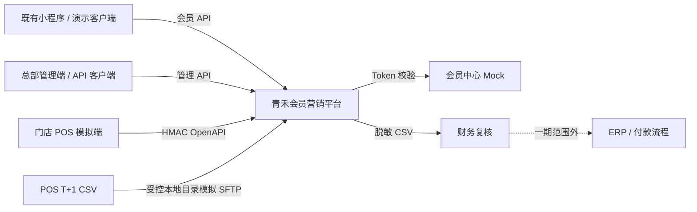
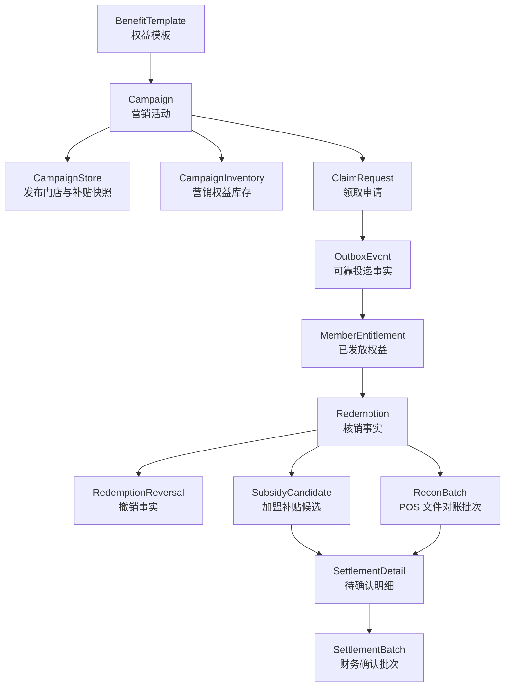
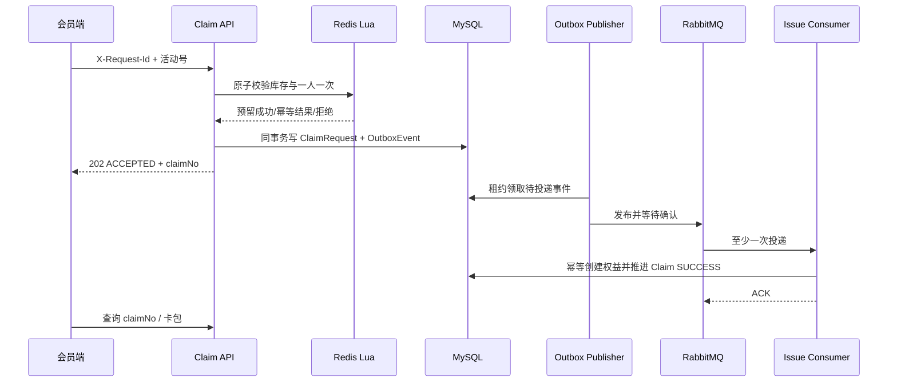
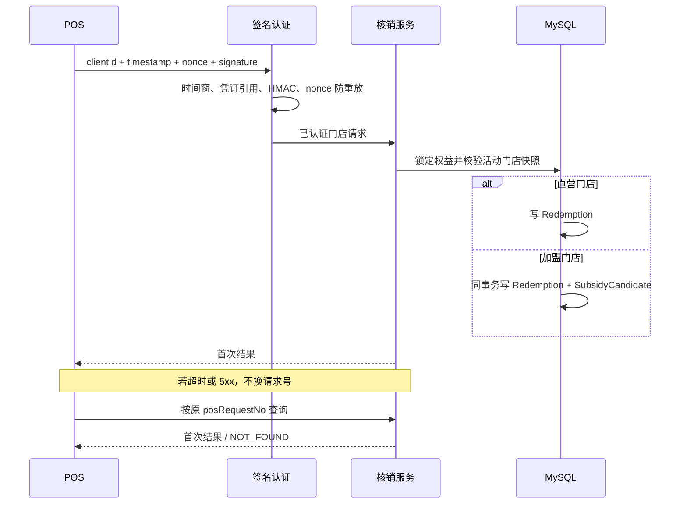
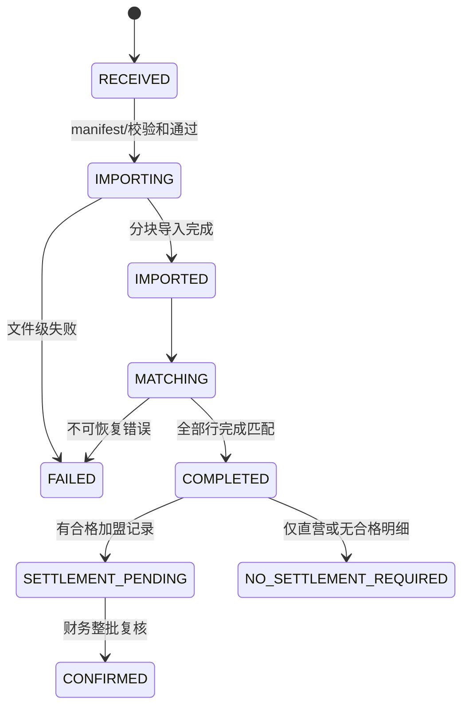
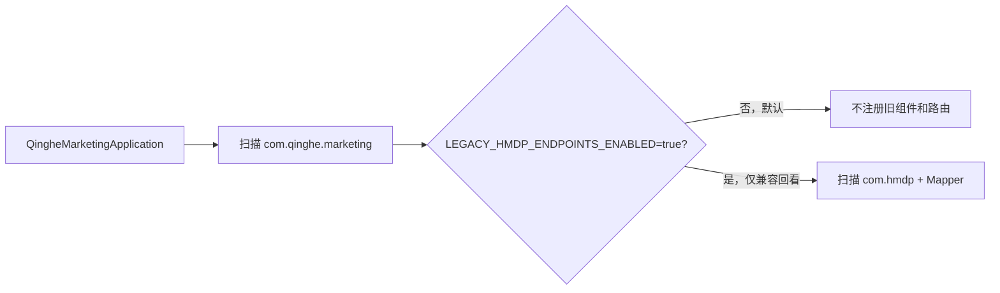

# 青禾茶饮会员营销平台架构说明

> 架构范围：优惠券权益、会员领取、门店 POS 履约、撤销、T+1 对账及加盟补贴确认前明细。所有外部组织和接口均为模拟；本文描述仓库中可验证的实现，不代表真实生产架构。

## 1. 系统边界



平台不重建小程序、会员中心、POS、ERP、点单或供应链。一期结算终点是“财务已确认、明细可导出”，不是实际付款。

## 2. 关键领域模型



模型刻意保持下列概念分离：

- `ClaimRequest` 是异步申请，`MemberEntitlement` 才是已经发放的可用资产；
- `Redemption` 是不可删除的履约事实，撤销以独立 `RedemptionReversal` 表达；
- `SubsidyCandidate` 是加盟店核销时产生的候选，不等于可结算明细；
- `ReconciliationDifference` 隔离异常事实，不进入正常结算；
- `SettlementBatch.CONFIRMED` 是复核状态，不是付款状态。

## 3. 核心链路

### 3.1 领取与异步发券



可靠性要点：Redis 只负责高并发预留，MySQL 保存权威业务事实；Outbox 避免“数据库提交成功但消息没发出”；重复消息通过业务唯一约束和投递记录去重；不可恢复失败进入补偿状态并归还预留。

### 3.2 POS 履约与未知结果恢复



同一个 `posRequestNo` 与不同请求摘要组合会返回冲突；同券并发通过数据库事务锁和唯一约束保证最多一个成功。当天原单撤销不会删除核销记录，结算锁定后拒绝撤销。

### 3.3 T+1 对账与加盟补贴



相同 `provider + batchNo + checksum` 可幂等续跑；同批次不同 checksum 记为冲突并保留原事实。坏行、平台缺失、POS 缺失、金额/状态/数据差异均被隔离。只有加盟店且核销一致的记录才能形成 `PENDING_CONFIRM` 明细。

## 4. 代码分层与依赖方向

青禾采用模块化单体，而不是为了展示强行拆微服务：

```text
HTTP Controller / Scheduler / MQ Listener
                 |
                 v
Application Service + Transaction Service
                 |
                 v
Domain Model + Repository Interface + Policy
                 |
                 v
JDBC / Redis / RabbitMQ / HTTP / File Adapter
```

- Controller 负责协议适配、鉴权和输入边界，不直接拼装数据库状态；
- Service 负责用例编排，Transaction Service 固化事务边界；
- Repository 接口表达领域需要，JDBC/Redis/RabbitMQ 实现留在适配层；
- `BusinessClock` 注入业务时间，避免测试依赖系统当前时间；
- `MoneyFen` 和数据库 `BIGINT` 表达人民币分，不使用浮点金额；
- 对外请求号、业务号、摘要和审计事实支持幂等与追踪。

## 5. 一致性与失败策略

| 风险 | 实现策略 | 恢复方式 |
|---|---|---|
| Redis 预留后应用失败 | 申请事实、预留状态和补偿任务分开记录 | 幂等补偿归还库存/领取资格 |
| DB 提交后 MQ 未发送 | Transactional Outbox + 租约 + 投递尝试 | Publisher 重扫；超过次数进入 DEAD |
| MQ 重复或迟到 | eventId、claimNo、权益唯一键和投递事实 | 返回既有结果，不重复发券 |
| POS 响应丢失 | 稳定 posRequestNo + 请求摘要 + 原结果查询 | 查询后仅以原编号和原内容重提 |
| 同券并发核销 | 数据库事务锁、状态校验和唯一约束 | 赢家成功，其余返回首次/冲突结果 |
| 对账大文件中断 | 分块事务、导入游标和块状态 | 相同文件从安全位置续跑 |
| 差异误入结算 | 差异单独落库，批次生成前再校验资格 | 受控重试或更正批次，不覆盖事实 |
| 已确认结算被回滚 | 发布手册禁止对业务事实执行破坏性逆迁移 | 应用回退 + 向前修复迁移 |

## 6. 安全边界

- 管理端、会员端和 POS 使用三套互不替代的身份边界；
- POS 请求使用 HMAC-SHA256、时间窗和 nonce 防重放；数据库只保存密钥管理器引用；
- 权益券码使用 AES-GCM 加密保存，并另存不可逆摘要用于定位；
- 管理 API 按 `campaign:*`、`inventory:*`、`recon:*`、`settlement:*` 等权限校验；
- 日志架构测试禁止输出完整 Token、Authorization、券码、签名、密码和手机号变量；
- 配置文件不保存本地数据库密码、管理 Token、会员中心密钥或权益加密密钥。

当前依赖审计仍显示旧 Spring Boot 2.3 基线存在大量版本命中。直接覆盖 BOM 中若干 jar 会形成未经支持的组合，因此真实部署前必须单独完成框架迁移、重新 SCA 和完整 Gate；这是一项明确阻断条件，不是“已经生产可用”。

## 7. 旧点评隔离边界



默认运行时不会加载旧点评的博客、关注、Feed、签到、店铺展示和秒杀入口，也不会启动其 RabbitMQ 监听器、缓存预热和拦截器。`com.hmdp.HmDianPingApplication` 仅保留为旧 IDE 启动配置的兼容转发类。青禾表使用 `qh_` 前缀，迁移不会修改旧 `tb_*` 表。

## 8. 验证架构

验证按风险分层，而不是只有 Controller Mock：

1. 领域与服务单元测试：状态机、金额、摘要、权限和失败分支；
2. 协议测试：OpenAPI 结构、会员中心 Mock、POS 客户端、CSV/manifest；
3. 真实基础设施集成：一次性 MySQL 数据库、隔离 Redis、RabbitMQ 队列与 DLQ；
4. 系统旅程：发布 → 领取 → Outbox → 发券 → 卡包 → 加盟核销 → 对账 → 结算；
5. 非功能验证：并发、饱和保护、响应丢失、重复投递、迁移回滚、敏感日志和依赖扫描。

最新可复核入口见 [一期成果证据索引](docs/verification/青禾茶饮_一期成果证据索引.md)。

## 9. 仍需真实项目补齐

- 真实会员中心、POS、SFTP、ERP 的协议确认和联调；
- Spring Boot 与中间件客户端的受支持版本迁移；
- 生产部署拓扑、密钥托管、证书、备份、灾备和容量评估；
- Prometheus/Grafana/日志平台与真实告警渠道；
- 管理端、小程序端和人工异常处理页面；
- 灰度、长稳压测、渗透测试、变更审批和真实验收。

这些内容没有证据时保持为未完成项，不从本地测试外推生产结论。
