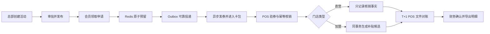

# 青禾茶饮会员营销平台

一个面向连锁茶饮场景的优惠券权益与门店履约后端：从总部活动审批、会员异步领券、卡包查询，到 POS 验券核销、当天撤销、T+1 对账和加盟补贴确认，形成可追踪、可补偿、可审计的业务闭环。

> **真实性边界**：青禾茶饮、十家试点门店、会员中心、POS 与数据均为模拟企业场景。本仓库有真实代码、数据库迁移和自动化验证，但没有真实甲方、厂商联调、生产流量或上线经历。旧 Spring Boot 2.3 依赖树尚未完成框架级升级，因此当前只适合本地学习与面试演示，不允许直接作为公网或生产部署依据。

## 一眼看懂业务



这里的“免费券”是会员无需支付购券款；加盟门店履约仍可能产生总部补贴。直营店参与对账但不生成补贴候选；`CONFIRMED` 只代表财务确认本平台明细，不代表 ERP 已入账或加盟商已经收款。

## 已实现范围

| 业务段 | 已实现能力 | 关键约束 |
|---|---|---|
| 门店与身份 | 版本化门店导入、直营/加盟属性、POS 凭证引用、会员会话交换 | 不保存 POS 明文密钥；管理、会员、POS 身份隔离 |
| 活动与库存 | 权益模板、活动草稿/审批/发布/终止、门店与补贴快照、审批式库存追加 | 发布后规则冻结；金额统一使用整数分 |
| 领取与发券 | Redis Lua 预留、ClaimRequest、Transactional Outbox、RabbitMQ 消费、失败补偿、卡包查询 | 同会员同活动最多成功一次；领取成功必须已有权益 |
| 门店履约 | HMAC 签名、nonce 防重放、验券、幂等核销、原请求查询、当天原单撤销 | 同券并发最多一次成功；未知结果复用原请求号恢复 |
| 对账与结算 | manifest/CSV 校验、分块续跑、差异分流、结算批次、整批确认、脱敏导出 | 直营只对账；加盟一致记录才进入待确认明细 |
| 运营支撑 | 跨域业务时间线、异常分页、积压快照、进程指标、审计与恢复手册 | 不提供无审计的通用改表、改 Redis 或消息重放入口 |

明确没有实现：支付退款、离线核销、ERP 自动入账/付款、真实 SFTP/POS/会员中心联调、完整管理端和小程序前端、生产监控平台、多品牌多币种。

## 这不是“给黑马点评换皮”

仓库保留了原有 `com.hmdp` 代码和 Git 演进轨迹，用于说明技术基础从哪里来；青禾新增业务全部位于 `com.qinghe.marketing`，使用独立 `qh_` 数据表、领域状态、接口契约和测试。

- 默认启动入口是 `com.qinghe.marketing.QingheMarketingApplication`；
- 默认只扫描青禾运行时，不注册旧点评 Service、Mapper、拦截器、消息监听器和接口；
- 博客、关注、Feed、签到、旧秒杀等入口默认不可用；
- 只有显式设置 `LEGACY_HMDP_ENDPOINTS_ENABLED=true` 才恢复旧模块，供回看历史实现；
- 复用的是 Spring Boot、Redis、RabbitMQ、MySQL 等工程经验，不把旧类改名冒充青禾新实现。

详细边界见 [架构说明](ARCHITECTURE.md) 和 [现有代码复用映射](docs/technical/一期需求_现有代码复用映射_v0.1.md)。

## 工程结构

```text
src/main/java/com/qinghe/marketing/
├── campaign/        权益模板、活动审批、发布快照、库存调整
├── claim/           领取受理、Redis 预留、Outbox 与可靠投递
├── entitlement/     异步发券、卡包、失败与到期处理
├── identity/        会员、管理端和 POS 身份边界
├── redemption/      POS 验券、核销、幂等与并发保护
├── reversal/        当天原单撤销与结算锁
├── reconciliation/ T+1 文件导入、续跑、匹配与差异
├── settlement/      加盟补贴明细、批次确认与导出
├── operations/      业务链路、异常、指标与恢复入口
├── store/           门店导入、资格和 POS 凭证引用
└── shared/          业务时钟、金额、编号、追踪和统一异常

src/main/resources/db/qinghe/
├── migration/       V001—V008 正向迁移
└── rollback/        R008—R001 仅限无业务事实的临时库回退

docs/
├── product/         PRD、需求基线和决策清单
├── contracts/       OpenAPI、JSON Schema、Mock 与 PoC
├── technical/       技术方案、外部依赖和复用边界
├── management/      WP00—WP11 任务、Gate 和检查点
├── operations/      告警排查、恢复、发布与回滚演练
└── verification/    测试、安全、PoC 与交付证据
```

## 本地启动

### 1. 前置条件

- JDK 8
- Maven 3.6+
- MySQL 8
- Redis 6.2+
- RabbitMQ 3（只有启用 Outbox publisher/claim consumer 时才实际参与异步链路）

### 2. 建库与迁移

创建独立的 `qinghe_marketing` 数据库，然后按文件名顺序执行 `src/main/resources/db/qinghe/migration/V001` 至 `V008`。

这些脚本不会修改旧点评的 `tb_*` 表。回滚脚本只用于尚未产生业务事实的临时开发库；一旦存在权益、核销、对账或已确认结算，必须使用向前修复迁移。

### 3. 注入本地配置

PowerShell 示例（值由本机环境提供，不要提交真实凭据）：

```powershell
$env:QINGHE_DB_URL = "jdbc:mysql://127.0.0.1:3306/qinghe_marketing?useSSL=false&serverTimezone=Asia/Shanghai&allowPublicKeyRetrieval=true"
$env:QINGHE_DB_USERNAME = "root"
$env:QINGHE_DB_PASSWORD = "<local-password>"
$env:QINGHE_REDIS_HOST = "127.0.0.1"
$env:QINGHE_REDIS_PORT = "6379"
$env:QINGHE_ADMIN_BEARER_TOKEN = "<local-admin-token>"
$env:QINGHE_ADMIN_PERMISSIONS = "store:import,campaign:edit,campaign:review,inventory:adjust,inventory:review,recon:operate,settlement:read,settlement:confirm,operation:read"
$env:QINGHE_RIGHT_CODE_KEY_BASE64 = "<base64-encoded-16-24-or-32-byte-aes-key>"
```

会员中心默认指向本机 Mock 地址 `http://127.0.0.1:18081`；POS 密钥只在数据库中保存 `secret://env/变量名` 一类引用，实际密钥从环境变量读取。

### 4. 启动应用

```powershell
mvn spring-boot:run
```

默认端口为 `8081`，接口分为三组：

- 会员端：`/api/v1/member/**`
- 总部管理端：`/api/v1/admin/**`
- POS 开放接口：`/openapi/v1/**`

完整字段、鉴权、签名、错误码和重试规则以 [接口设计说明](docs/contracts/青禾茶饮_一期接口设计说明_v1.0.md) 与 [OpenAPI](docs/contracts/qinghe-platform-api-v1.0.yaml) 为准。

## 验证

不依赖外部中间件的快速回归：

```powershell
mvn "-Dtest=com.qinghe.marketing.**.*Test,VoucherOrderTransactionServiceTest" test
```

包含真实 MySQL、隔离 Redis/RabbitMQ 的完整 Gate 需要通过 `qinghe.it.*` 参数注入本地测试环境。最近一次 WP-10 完整结果为 `181 RUN / 181 PASS`；它是改造 WP-11 前的已提交基线，不把本机容量样本解释为生产 SLA。最新命令、清理结果和风险结论见：

- [WP-10 系统验证检查点](docs/management/WP10_开发检查点_2026-09-10.md)
- [接口 PoC 证据矩阵](docs/verification/WP10_接口PoC执行证据矩阵_2026-09-10.md)
- [故障、并发与安全矩阵](docs/verification/WP10_故障并发与安全验证矩阵_2026-09-10.md)
- [依赖与安全审计](docs/verification/WP10_依赖与安全审计_2026-09-10.md)

## 推荐阅读顺序

1. [PRD：业务问题、范围和验收](docs/product/青禾茶饮_优惠券权益与门店履约模块_PRD_v1.0.md)
2. [接口设计：系统如何协作](docs/contracts/青禾茶饮_一期接口设计说明_v1.0.md)
3. [架构说明：代码如何实现](ARCHITECTURE.md)
4. [开发任务与 Gate](docs/management/青禾茶饮_一期开发任务拆分与估时_v0.1.md)
5. [成果证据索引](docs/verification/青禾茶饮_一期成果证据索引.md)

## 当前交付结论

一期领域闭环已经在本地模拟条件下实现并通过 WP-00—WP-10 的分阶段验证；WP-11 负责旧入口隔离和成果整理。项目可以用于解释需求如何转化为契约、领域模型、代码、测试和上线前风险决策，但不能表述为真实商业交付或生产上线。
