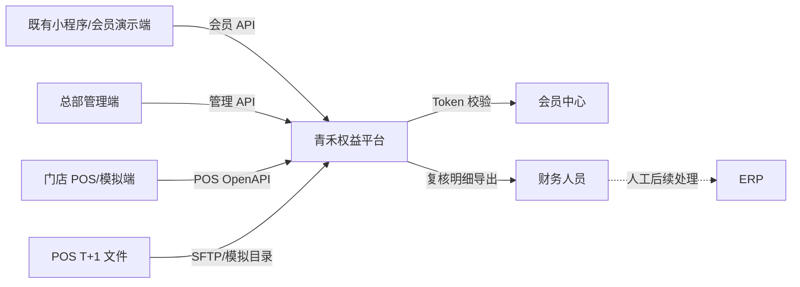
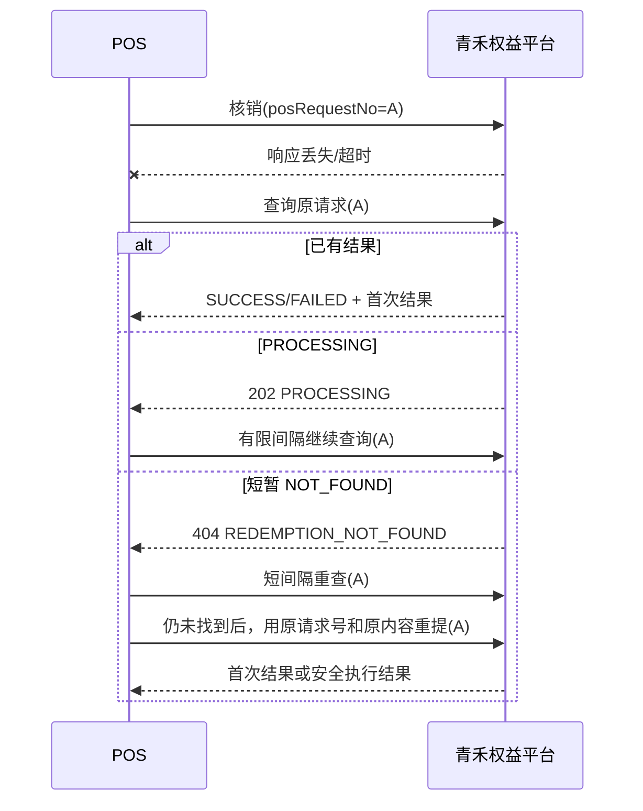

# 青禾茶饮会员营销平台

## 优惠券权益与门店履约模块接口设计说明 v1.0

> 文档状态：接口评审基线（模拟）  
> 对应需求：[完整 PRD v1.0](../product/青禾茶饮_优惠券权益与门店履约模块_PRD_v1.0.md)  
> 对应技术方案：[技术方案 v0.1](../technical/青禾茶饮_优惠券权益与门店履约模块技术方案_v0.1.md)  
> 机器可读附件：[青禾平台 OpenAPI](./qinghe-platform-api-v1.0.yaml)、[会员中心模拟契约](./member-center-api-v0.1.yaml)、[POS 模拟契约](./pos-rights-api-v0.1.yaml)、[对账 manifest Schema](./reconciliation-manifest-v1.0.schema.json)  
> 真实性声明：“青禾茶饮”、会员中心、POS、门店和接口地址均为项目推演设定；本文不是任何真实厂商提供或确认的接口文档  
> 版本日期：2026-09-08

---

## 1. 文档目的

本文用于双方 IT 接口确认和后续开发，统一以下问题：

1. 哪个系统提供接口、哪个系统调用；
2. 请求和响应字段、状态、错误码如何表达；
3. 身份认证、签名、幂等、超时和重试如何处理；
4. POS 结果未知时如何恢复，避免重复核销；
5. T+1 文件如何命名、校验、导入、更正和对账；
6. 哪些约定可以进入 Mock，哪些仍需真实厂商确认。

本文描述“双方怎么说话”。截至 2026-09-10，POS 验券、核销、原请求查询、当天撤销、T+1 对账和结算复核已完成本地模拟业务实现；运营可观测性和系统级发布演练仍按后续工作包推进。接口可被 Mock 调用或在本地实现中通过测试，均不表示真实系统联调或生产上线。

## 2. 系统边界与调用方向



| 接口域 | 提供方 | 调用方 | 一期方式 |
|---|---|---|---|
| 会员中心会话校验 | 会员中心 | 青禾权益平台 | 外部同步 API，当前使用 Mock |
| 会员活动、领取和卡包 | 青禾权益平台 | 小程序/会员演示端 | 平台 REST API |
| 活动、门店、运营和财务 | 青禾权益平台 | 总部管理端 | 平台 REST API |
| 验券、核销、查询和撤销 | 青禾权益平台 | POS | 开放 REST API |
| POS 日对账 | POS | 青禾权益平台 | T+1 CSV 文件 |
| 结算复核导出 | 青禾权益平台 | 财务人员 | CSV 下载；一期无 ERP 在线接口 |

一期不包含支付、退款、离线核销、ERP 入账或自动付款接口。

## 3. 环境与基础地址

以下地址只定义命名规则，实际主机、端口和证书由部署环境提供。

| 环境 | 会员 API | 管理 API | POS OpenAPI | 外部会员中心 |
|---|---|---|---|---|
| 本地 | `/api/v1/member` | `/api/v1/admin` | `/openapi/v1` | `https://mock-member-center.local` |
| 集成测试 | 待部署配置 | 待部署配置 | 待部署配置 | 会员中心 Mock |
| 真实联调 | 不适用 | 不适用 | 不适用 | 只有真实项目取得厂商资料后确定 |

所有 URL 通过配置注入，不把主机、凭证或环境专用路径写死在业务代码中。

## 4. 通用协议

### 4.1 编码与数据格式

- HTTPS；本地 Mock 可使用 HTTP；
- 请求和响应使用 `application/json; charset=UTF-8`；
- 时间使用 ISO 8601 并携带时区，例如 `2026-09-08T14:30:00+08:00`；
- 一期业务自然日按北京时间 `Asia/Shanghai`；
- 金额使用人民币分的整数，不使用浮点数；
- 对外业务编号均使用字符串，调用方不得推断数据库主键；
- 枚举值使用大写英文和下划线；
- `null` 与字段缺失的含义必须由字段表说明，禁止用空字符串表达未知金额或时间。

### 4.2 通用请求头

| 请求头 | 会员端 | 管理端 | POS | 说明 |
|---|---:|---:|---:|---|
| `X-Request-Id` | 必填 | 必填 | 不使用 | 调用方生成，8—64 位，用于追踪和写操作幂等 |
| `Authorization` | 登录后必填 | 必填 | 不使用 | `Bearer <token>`；会员与管理 Token 不通用 |
| `X-POS-Request-Id` | 不使用 | 不使用 | 写操作必填 | 必须与请求体 `posRequestNo` 一致 |
| `X-Client-Id` | 不使用 | 不使用 | 必填 | 标识 POS 接入凭证，不等于门店编号 |
| `X-Timestamp` | 不使用 | 不使用 | 必填 | Unix 时间戳秒 |
| `X-Nonce` | 不使用 | 不使用 | 必填 | 单次签名随机串，8—64 位 |
| `X-Signature` | 不使用 | 不使用 | 必填 | HMAC-SHA256 十六进制小写摘要 |

平台在所有响应中回传 `requestId`。如果调用方没有提供有效请求号，平台生成内部 requestId，但写操作仍可因缺少幂等号被拒绝。

### 4.3 通用成功响应

```json
{
  "code": "OK",
  "message": "success",
  "requestId": "req_20260908_000001",
  "data": {}
}
```

### 4.4 通用失败响应

```json
{
  "code": "REQUEST_CONFLICT",
  "message": "request id was reused with different business content",
  "requestId": "req_20260908_000001",
  "details": [
    {
      "field": "requestId",
      "reason": "DIGEST_MISMATCH"
    }
  ]
}
```

`message` 用于排查，不作为程序判断依据；客户端必须根据 `HTTP 状态码 + code` 处理。

### 4.5 分页响应

```json
{
  "code": "OK",
  "message": "success",
  "requestId": "req_20260908_000002",
  "data": {
    "items": [],
    "pageNo": 1,
    "pageSize": 20,
    "total": 0
  }
}
```

- `pageNo` 从 1 开始；
- 默认 `pageSize=20`，最大 100；
- 稳定列表必须明确排序字段；默认按创建时间倒序、业务编号倒序；
- 深分页是否改用游标由性能测试决定，不改变业务语义。

### 4.6 HTTP 状态码

| HTTP | 含义 | 是否可直接重试 |
|---:|---|---|
| 200 | 成功或相同幂等请求返回首次结果 | 不需要 |
| 202 | 已受理、仍在处理 | 查询原请求结果，不创建新请求 |
| 400 | 格式或参数错误 | 修改请求后再提交 |
| 401 | Token、凭证或签名无效 | 重新认证，不盲目重试 |
| 403 | 身份有效但无权限或主体被冻结 | 不重试相同请求 |
| 404 | 资源或原请求暂未找到 | 按具体接口规则处理 |
| 409 | 状态、幂等摘要或业务冲突 | 查询首次结果或人工处理 |
| 422 | 请求格式正确但业务规则不成立 | 修正规则或数据 |
| 429 | 限流 | 按 `Retry-After` 有限退避 |
| 500 | 未知平台错误 | 写操作先查原结果 |
| 503 | 临时不可用 | 有限退避；核销先查原结果 |

## 5. 幂等、摘要和重试

### 5.1 幂等号归属

| 场景 | 幂等号 | 生成方 | 重试规则 |
|---|---|---|---|
| 会员会话交换 | `X-Request-Id` | 小程序 | 同一次交换复用 |
| 会员领取 | `X-Request-Id` | 小程序 | 同一次领取意图永久复用 |
| 管理端写操作 | `X-Request-Id` | 管理端 | 同一次点击/提交复用 |
| POS 验券 | `posRequestNo` | POS | 同一次验券复用；验券无状态变化 |
| POS 核销 | `posRequestNo` | POS | 结果未知时禁止换号 |
| POS 撤销 | `posRequestNo` | POS | 与核销请求号不同，但撤销自身重试必须复用 |
| 对账文件 | `provider + batch_no` | POS | 内容相同为重复，内容变化为冲突 |

### 5.2 请求摘要

平台对有副作用的请求保存规范化业务摘要：

```text
相同幂等号 + 相同摘要      → 返回首次处理记录或当前结果
相同幂等号 + 不同摘要      → 409 / REQUEST_CONFLICT
不同幂等号 + 同一业务资源  → 按资源状态和唯一约束处理
```

摘要包含稳定业务字段，不包含签名、nonce、传输时间戳和可变追踪字段。JSON 对象按字段名排序、数字按十进制规范化、字符串保持 UTF-8 原值后计算 SHA-256。

### 5.3 写操作结果未知

```text
调用写接口
→ 收到明确业务结果：结束
→ 超时、连接断开、500 或 503：结果未知
→ 使用原请求号查询
→ PROCESSING：继续有限查询
→ SUCCESS/FAILED：接受首次终态
→ 短间隔查询仍 NOT_FOUND：仅允许用原请求号和原业务内容重提
```

禁止通过新请求号“试试看”，否则可能把网络未知变成重复业务操作。

## 6. 认证、签名与权限

### 6.1 会员端

首次使用会员中心 Token 调用会话交换接口。平台校验成功后签发短期平台 Token；后续领取和卡包接口只使用平台 Token，不在领取热路径同步调用会员中心。

平台不得信任请求体中自行传入的 `memberNo`，会员身份只来自已验证会话。

### 6.2 管理端

管理 Token 至少包含 `operatorId`、角色、权限集合和过期时间。创建人不得无审计记录直接审批自己的活动或库存调整。

| 权限码 | 典型角色 | 能力 |
|---|---|---|
| `campaign:edit` | 市场 | 模板和活动草稿 |
| `campaign:review` | 运营/审核人 | 活动审核 |
| `inventory:adjust` | 市场 | 库存增加申请 |
| `inventory:review` | 运营/审核人 | 库存增加审批 |
| `store:import` | 系统管理员 | 试点门店导入 |
| `operation:read` | 运营/客服 | 链路和异常查询 |
| `recon:operate` | 运营 | 对账批次处理 |
| `settlement:read` | 财务 | 结算批次和明细查询 |
| `settlement:confirm` | 财务 | 整批确认 |

### 6.3 POS 签名

一期模拟签名串规则：

```text
HTTP_METHOD
NORMALIZED_PATH
X_CLIENT_ID
X_TIMESTAMP
X_NONCE
SHA256_HEX(RAW_BODY)
```

以上六段以单个换行符连接，不在最后追加换行。使用门店独立密钥计算 `HMAC-SHA256`，结果转十六进制小写写入 `X-Signature`。

- 查询接口的空请求体按空字节计算 SHA-256；
- 路径使用原始大小写，不包含协议、主机和 query；
- 允许时钟偏差模拟默认 300 秒，最终值可配置；
- nonce 在有效窗口内不得重复；
- clientId 必须绑定允许操作的门店，不能仅相信请求体 `storeCode`；
- 密钥只保存引用或加密值，不进入仓库、普通日志和接口响应。

## 7. 接口总览

### 7.1 外部会员中心提供

| 编号 | 方法 | 路径 | 调用方 | 用途 |
|---|---|---|---|---|
| EXT-MEM-01 | POST | `/openapi/v1/member-sessions/introspect` | 青禾平台 | 校验会员 Token |

### 7.2 青禾会员 API

| 编号 | 方法 | 路径 | 权限 | 用途 |
|---|---|---|---|---|
| MEM-01 | POST | `/api/v1/member/sessions/exchange` | 无平台会话 | 会员中心 Token 换平台会话 |
| MEM-02 | GET | `/api/v1/member/campaigns` | 会员 | 查询可见活动 |
| MEM-03 | GET | `/api/v1/member/campaigns/{campaignNo}` | 会员 | 查询活动详情和领取资格 |
| MEM-04 | POST | `/api/v1/member/campaigns/{campaignNo}/claims` | 会员 | 提交领取 |
| MEM-05 | GET | `/api/v1/member/claims/{claimNo}` | 会员 | 查询领取结果 |
| MEM-06 | GET | `/api/v1/member/entitlements` | 会员 | 查询卡包 |
| MEM-07 | GET | `/api/v1/member/entitlements/{entitlementNo}` | 会员 | 查询权益详情 |

### 7.3 青禾管理 API

| 接口组 | 主要路径 | 能力 |
|---|---|---|
| 权益模板 | `/api/v1/admin/benefit-templates` | 创建、修改草稿、详情和列表 |
| 门店导入 | `/api/v1/admin/store-imports` | 预检、提交和结果查询 |
| 活动 | `/api/v1/admin/campaigns` | 草稿、提交、审核、发布信息、终止和查询 |
| 库存调整 | `/api/v1/admin/inventory-adjustments` | 创建、提交、审核和查询 |
| 运营查询 | `/api/v1/admin/business-traces` | 按业务编号追踪完整链路 |
| 异常中心 | `/api/v1/admin/exceptions` | 领取、消息、核销和对账异常查询 |
| 对账批次 | `/api/v1/admin/recon-batches` | 查询、重试匹配和差异查看 |
| 结算批次 | `/api/v1/admin/settlement-batches` | 生成、查看、整批确认和导出 |

### 7.4 青禾 POS OpenAPI

| 编号 | 方法 | 路径 | 用途 |
|---|---|---|---|
| POS-01 | POST | `/openapi/v1/rights/verify` | 在线验券，不锁券 |
| POS-02 | POST | `/openapi/v1/redemptions` | 幂等核销 |
| POS-03 | GET | `/openapi/v1/redemptions/by-request/{posRequestNo}` | 查询原核销结果 |
| POS-04 | POST | `/openapi/v1/redemptions/{redemptionNo}/reversals` | 当天原单撤销 |

---

## 8. 外部会员中心接口

### 8.1 EXT-MEM-01 校验会员 Token

```http
POST /openapi/v1/member-sessions/introspect
X-Request-Id: req-member-0001
X-Client-Id: qinghe-rights
X-Timestamp: 1788849000
X-Nonce: n-8f42a119
X-Signature: <hmac-sha256>
Content-Type: application/json
```

```json
{
  "memberToken": "mock-member-token-active"
}
```

成功响应：

```json
{
  "code": "OK",
  "message": "success",
  "requestId": "req-member-0001",
  "data": {
    "memberNo": "M100086",
    "status": "ACTIVE",
    "levelCode": "NORMAL",
    "tokenExpiresAt": "2026-09-08T15:30:00+08:00"
  }
}
```

| HTTP | code | 平台处理 |
|---:|---|---|
| 200 | `OK` | 建立平台会员映射和短期会话 |
| 401 | `TOKEN_INVALID` / `TOKEN_EXPIRED` | 不重试同一 Token，要求重新登录 |
| 403 | `MEMBER_FROZEN` / `MEMBER_CANCELLED` | 不建立会话，不默认放行 |
| 429 | `RATE_LIMITED` | 按 Retry-After 有限重试 |
| 503 | `SYSTEM_BUSY` | 返回临时不可用，不信任前端 memberNo |

当前冻结语义：领取主链路只解析平台会话；会员中心实时冻结推送不在一期模拟契约内。

## 9. 会员 API

### 9.1 MEM-01 交换平台会话

```http
POST /api/v1/member/sessions/exchange
X-Request-Id: req-mini-0001
Content-Type: application/json
```

```json
{
  "memberToken": "mock-member-token-active"
}
```

```json
{
  "code": "OK",
  "message": "success",
  "requestId": "req-mini-0001",
  "data": {
    "accessToken": "<platform-access-token>",
    "tokenType": "Bearer",
    "expiresAt": "2026-09-08T16:00:00+08:00",
    "member": {
      "memberNoMasked": "M10***86",
      "levelCode": "NORMAL"
    }
  }
}
```

平台不得把会员中心 Token 原样作为自己的访问令牌，也不得写入普通日志。

### 9.2 MEM-02/MEM-03 活动列表与详情

列表查询参数：

| 参数 | 类型 | 必填 | 说明 |
|---|---|---:|---|
| `pageNo` | integer | 否 | 默认 1 |
| `pageSize` | integer | 否 | 默认 20，最大 100 |
| `status` | string | 否 | 会员端一期只允许 `ACTIVE` |

活动摘要与详情至少返回：

| 字段 | 类型 | 说明 |
|---|---|---|
| `campaignNo` | string | 活动业务编号 |
| `name` | string | 活动名称 |
| `benefitType` | enum | `FREE_PRODUCT` / `CASH_DISCOUNT` |
| `title` | string | 权益标题 |
| `beginAt` / `endAt` | date-time | 领取窗口 |
| `claimStatus` | enum | `ELIGIBLE` / `ALREADY_CLAIMED` / `SOLD_OUT` / `NOT_ACTIVE` |
| `rules` | object | 展示所需的规则快照 |
| `applicableStores` | array | 可用门店摘要；支持分页或单独查询的实现优化 |

不向会员端返回活动剩余精确库存、补贴金额、内部审核人或财务字段。

### 9.3 MEM-04 提交领取

```http
POST /api/v1/member/campaigns/CAM20260908001/claims
Authorization: Bearer <platform-access-token>
X-Request-Id: claim-intent-9c501f31
Content-Type: application/json
```

```json
{
  "clientRequestedAt": "2026-09-08T14:40:15+08:00"
}
```

受理响应：

```json
{
  "code": "ACCEPTED",
  "message": "claim is processing",
  "requestId": "claim-intent-9c501f31",
  "data": {
    "claimNo": "CLM20260908000001",
    "status": "PROCESSING",
    "nextPollAfterMillis": 500
  }
}
```

| 场景 | HTTP/code | 副作用 |
|---|---|---|
| 首次成功受理 | 202 / `ACCEPTED` | 创建或关联一条 PROCESSING 申请 |
| 相同请求重试 | 200 或 202 / 首次状态 | 不重复预留、不重复发券 |
| 请求号内容变化 | 409 / `REQUEST_CONFLICT` | 不改变首次记录 |
| 已领取 | 409 / `ALREADY_CLAIMED` | 返回原 claimNo 或 entitlementNo 的安全引用 |
| 库存不足 | 409 / `SOLD_OUT` | 不生成成功权益 |
| 活动不可领取 | 422 / `CAMPAIGN_NOT_ACTIVE` | 不预留库存 |

### 9.4 MEM-05 查询领取结果

```json
{
  "code": "OK",
  "message": "success",
  "requestId": "req-mini-0003",
  "data": {
    "claimNo": "CLM20260908000001",
    "status": "SUCCESS",
    "entitlementNo": "ENT20260908000001",
    "failureCode": null,
    "updatedAt": "2026-09-08T14:40:16+08:00"
  }
}
```

| 状态 | 会员端展示 | 约束 |
|---|---|---|
| `PROCESSING` | 领取结果确认中 | 继续按建议间隔查询 |
| `COMPENSATING` | 领取结果确认中 | 不诱导立即重新领取 |
| `SUCCESS` | 领取成功 | 必须存在可查询 entitlementNo |
| `FAILED` | 领取失败 | 库存和占位补偿已经完成 |

### 9.5 MEM-06/MEM-07 卡包

`GET /api/v1/member/entitlements?status=AVAILABLE&pageNo=1&pageSize=20`

| 字段 | 类型 | 说明 |
|---|---|---|
| `entitlementNo` | string | 权益业务编号 |
| `title` | string | 展示标题 |
| `benefitType` | enum | 权益类型 |
| `status` | enum | `AVAILABLE` / `USED` / `EXPIRED` / `CANCELLED` |
| `validFrom` / `validUntil` | date-time | 有效期 |
| `applicableStoreSummary` | object | 门店范围摘要 |
| `protectedRightCode` | string/null | 详情按权限返回的受保护码，不在列表返回完整值 |
| `usageRules` | object | 详情返回发布时冻结的使用规则 |
| `redemptionSummary` | object/null | 已使用时返回门店和时间摘要 |

会员 Token 只能读取自己的权益；修改 URL 中 entitlementNo 不得读取其他会员数据。

## 10. 管理 API

### 10.1 接口清单

| 编号 | 方法 | 路径 | 权限 | 说明 |
|---|---|---|---|---|
| ADM-TPL-01 | POST | `/api/v1/admin/benefit-templates` | `campaign:edit` | 创建权益模板 |
| ADM-TPL-02 | PUT | `/api/v1/admin/benefit-templates/{templateNo}` | `campaign:edit` | 修改未发布引用的模板 |
| ADM-TPL-03 | GET | `/api/v1/admin/benefit-templates/{templateNo}` | `campaign:edit` | 模板详情 |
| ADM-TPL-04 | GET | `/api/v1/admin/benefit-templates` | `campaign:edit` | 模板列表 |
| ADM-STORE-01 | POST | `/api/v1/admin/store-imports/preview` | `store:import` | 上传并预检门店文件 |
| ADM-STORE-02 | POST | `/api/v1/admin/store-imports/{importNo}/commit` | `store:import` | 提交已通过预检的版本 |
| ADM-STORE-03 | GET | `/api/v1/admin/store-imports/{importNo}` | `store:import` | 导入结果和冲突明细 |
| ADM-CAM-01 | POST | `/api/v1/admin/campaigns` | `campaign:edit` | 创建活动草稿 |
| ADM-CAM-02 | PUT | `/api/v1/admin/campaigns/{campaignNo}` | `campaign:edit` | 修改活动草稿 |
| ADM-CAM-03 | POST | `/api/v1/admin/campaigns/{campaignNo}/submit` | `campaign:edit` | 提交审核 |
| ADM-CAM-04 | POST | `/api/v1/admin/campaigns/{campaignNo}/reviews` | `campaign:review` | 审核通过或拒绝 |
| ADM-CAM-05 | POST | `/api/v1/admin/campaigns/{campaignNo}/terminate` | `campaign:review` | 提前终止活动 |
| ADM-CAM-06 | GET | `/api/v1/admin/campaigns/{campaignNo}` | 管理只读权限 | 活动详情和版本 |
| ADM-CAM-07 | GET | `/api/v1/admin/campaigns` | 管理只读权限 | 活动列表 |
| ADM-INV-01 | POST | `/api/v1/admin/campaigns/{campaignNo}/inventory-adjustments` | `inventory:adjust` | 创建库存增加草稿 |
| ADM-INV-02 | POST | `/api/v1/admin/inventory-adjustments/{adjustmentNo}/submit` | `inventory:adjust` | 提交库存调整审核 |
| ADM-INV-03 | POST | `/api/v1/admin/inventory-adjustments/{adjustmentNo}/reviews` | `inventory:review` | 审核库存调整 |
| ADM-INV-04 | GET | `/api/v1/admin/inventory-adjustments/{adjustmentNo}` | 管理只读权限 | 查询审批与生效结果 |
| ADM-OPS-01 | GET | `/api/v1/admin/business-traces` | `operation:read` | 按一个业务编号查链路 |
| ADM-OPS-02 | GET | `/api/v1/admin/exceptions` | `operation:read` | 异常列表 |
| ADM-OPS-03 | GET | `/api/v1/admin/operations/metrics` | `operation:read` | 进程计数与数据库状态快照 |
| ADM-OPS-04 | GET | `/api/v1/admin/exceptions/redis-orphan-reservations` | `operation:read` | 按活动有界检查 Redis 孤儿预留 |
| ADM-REC-01 | GET | `/api/v1/admin/recon-batches` | `recon:operate` | 对账批次列表 |
| ADM-REC-02 | GET | `/api/v1/admin/recon-batches/{reconBatchNo}` | `recon:operate` | 批次汇总、错误和差异 |
| ADM-REC-03 | POST | `/api/v1/admin/recon-batches/{reconBatchNo}/retry` | `recon:operate` | 对可恢复失败执行幂等重试 |
| ADM-SET-01 | POST | `/api/v1/admin/recon-batches/{reconBatchNo}/settlement-batch` | `settlement:read` | 生成待确认结算批次 |
| ADM-SET-02 | GET | `/api/v1/admin/settlement-batches` | `settlement:read` | 结算批次列表 |
| ADM-SET-03 | GET | `/api/v1/admin/settlement-batches/{settlementBatchNo}` | `settlement:read` | 批次汇总和明细 |
| ADM-SET-04 | POST | `/api/v1/admin/settlement-batches/{settlementBatchNo}/confirm` | `settlement:confirm` | 财务整批确认 |
| ADM-SET-05 | GET | `/api/v1/admin/settlement-batches/{settlementBatchNo}/export` | `settlement:read` | 导出复核 CSV |

列表查询统一支持 `pageNo`、`pageSize`，并按业务域增加状态、日期、活动和门店筛选。任何管理查询都必须按权限过滤敏感字段。

### 10.2 ADM-TPL-01 创建权益模板

```json
{
  "templateName": "青禾鲜奶茶兑换券",
  "benefitType": "FREE_PRODUCT",
  "title": "免费兑换指定中杯饮品",
  "description": "限参与门店使用",
  "productCode": "DRINK-M-001",
  "benefitValueFen": null,
  "validityType": "RELATIVE_DAYS",
  "validityValue": 7,
  "usageRules": {
    "allowStacking": false,
    "minimumOrderFen": 0,
    "customerNotice": "每笔订单限用一张"
  }
}
```

| 字段 | 规则 |
|---|---|
| `benefitType` | `FREE_PRODUCT` 或 `CASH_DISCOUNT` |
| `productCode` | FREE_PRODUCT 必填，CASH_DISCOUNT 可为空 |
| `benefitValueFen` | CASH_DISCOUNT 必填且大于 0，FREE_PRODUCT 可为空 |
| `validityType` | `FIXED_RANGE` 或 `RELATIVE_DAYS` |
| `validityValue` | RELATIVE_DAYS 必填，正整数 |
| `validFrom` / `validUntil` | FIXED_RANGE 必填且结束时间晚于开始时间 |
| `usageRules` | 发布时作为不可变规则快照的一部分 |

模板已经被发布活动引用后，PUT 返回 `409/TEMPLATE_VERSION_LOCKED`；需要变化时创建新模板版本。

### 10.3 ADM-STORE-01/02 门店导入

预检使用 `multipart/form-data` 上传 CSV，表头为：

```csv
source_version,store_code,store_name,ownership_type,status,pos_version
STORE-20260908-01,QH001,青禾中心店,DIRECT,ACTIVE,POS-3.2
STORE-20260908-01,QH006,青禾湖滨加盟店,FRANCHISE,ACTIVE,POS-3.2
```

预检响应：

```json
{
  "code": "OK",
  "message": "preview completed",
  "requestId": "store-import-001",
  "data": {
    "importNo": "IMP202609080001",
    "status": "PREVIEWED",
    "totalRows": 10,
    "validRows": 10,
    "errorRows": 0,
    "sourceVersion": "STORE-20260908-01",
    "errors": []
  }
}
```

- 同一 `source_version` 和同一文件摘要重复提交返回首次导入记录；
- 同一版本但内容变化返回 `STORE_IMPORT_CONFLICT`；
- 未通过预检不能 commit；
- 门店停用不删除历史 CampaignStore、核销和对账记录；
- 一期只有确认名单内且 POS 版本满足要求的门店可以启用 POS 凭证。

### 10.4 ADM-CAM-01 创建活动

```json
{
  "name": "九月会员回馈活动",
  "description": "十家试点门店免费饮品券",
  "templateNo": "TPL202609080001",
  "claimBeginAt": "2026-09-15T10:00:00+08:00",
  "claimEndAt": "2026-09-22T22:00:00+08:00",
  "initialStock": 100000,
  "memberClaimLimit": 1,
  "storeCodes": ["QH001", "QH002", "QH006", "QH007"],
  "franchiseSubsidyFen": 350
}
```

保存后返回 `campaignNo`、`status=DRAFT` 和 `version`。服务端根据门店主数据生成快照：

- 直营店 `subsidyFen=0`；
- 同一活动全部加盟店 `subsidyFen=franchiseSubsidyFen`；
- 请求不得按门店分别上传不同补贴金额；
- 无加盟店时 `franchiseSubsidyFen` 可为空；存在加盟店时必填且不得为负数；
- 一期 `memberClaimLimit` 只能为 1。

### 10.5 ADM-CAM-03/04 提交与审核

提交审核：

```json
{
  "expectedVersion": 3,
  "comment": "门店和补贴已与试点名单核对"
}
```

审核：

```json
{
  "decision": "APPROVE",
  "expectedVersion": 4,
  "comment": "同意按当前规则发布"
}
```

`decision` 为 `APPROVE` 或 `REJECT`。审核通过后活动进入 SCHEDULED；到达时间后系统幂等进入 ACTIVE。提交和审核均保存操作者、时间、前后状态、版本和意见。

| 冲突 | code |
|---|---|
| 活动不在允许状态 | `CAMPAIGN_STATE_CONFLICT` |
| 核心字段缺失 | `CAMPAIGN_INCOMPLETE` |
| 版本已变化 | `VERSION_CONFLICT` |
| 创建人不允许自审 | `SELF_APPROVAL_NOT_ALLOWED` |
| 门店状态失效 | `STORE_NOT_ELIGIBLE` |

### 10.6 ADM-INV-01/02/03 库存增加

创建草稿：

```json
{
  "incrementStock": 20000,
  "reason": "活动领取速度超出预期，申请追加两万份",
  "expectedCampaignVersion": 7
}
```

审核：

```json
{
  "decision": "APPROVE",
  "expectedAdjustmentVersion": 2,
  "comment": "预算和履约能力已确认"
}
```

状态：

```text
DRAFT → PENDING_APPROVAL → APPROVED → APPLIED
                         ↘ REJECTED
APPROVED → APPLY_FAILED → APPLIED
```

- 只接受正整数 `incrementStock`；
- 只有 SCHEDULED/ACTIVE 活动可以提交并生效；
- ENDED/TERMINATED/REJECTED 活动不得追加；
- APPROVED 只代表审核通过，APPLIED 才表示库存已增加；
- 重复审核或执行返回原调整结果，不重复增加；
- 响应返回 `beforeTotalStock`、`incrementStock`、`afterTotalStock`、状态和版本。

### 10.7 ADM-OPS-01/02/03 运营查询与指标

```http
GET /api/v1/admin/business-traces?identifierType=POS_REQUEST_NO&identifierValue=POS-QH006-20260908-0001
```

`identifierType` 支持：

```text
CLAIM_NO
EVENT_ID
ENTITLEMENT_NO
POS_REQUEST_NO
REDEMPTION_NO
RECON_BATCH_NO
SETTLEMENT_BATCH_NO
```

响应按照时间返回关联节点，但不暴露完整会员 Token、平台 Token、密钥、签名或明文券码。客服只有只读权限，不能通过该接口直接修改业务终态。

异常列表以长时间 `PROCESSING`/`COMPENSATING`、Outbox `DEAD`、领取死信处理失败、POS 失败、撤销拒绝、文件缺失、坏行、对账差异和超时待确认批次等持久事实为来源，支持按异常类型和原业务状态分页过滤。`allowedActions` 只返回预定义动作标识；`TRACE_ONLY` 表示当前只允许定位，不存在通用改表入口；`RECON_RETRY` 和 `REVIEW_SETTLEMENT` 必须继续调用各自受权限、版本门闩和审计保护的业务接口。

Redis 预留不属于 MySQL 持久事实，使用独立的同域只读入口按活动执行有界检查：

```http
GET /api/v1/admin/exceptions/redis-orphan-reservations?campaignId=10&limit=100
```

该接口只返回超过 `qinghe.claim.recovery.orphan-seconds` 且找不到对应 `ClaimRequest` 的预留；`limit` 最大为 500，响应同时给出 `scanned` 和 `truncated`，避免一次排障扫描拖垮 Redis。它不执行补偿，实际恢复仍由已有孤儿预留恢复任务完成。

`GET /api/v1/admin/operations/metrics` 同时返回：

- 当前应用进程内领取、POS 和对账计数，包括接受、拒绝、成功、失败、累计耗时和幂等命中；
- MySQL 权威状态快照，包括领取/Outbox/POS/对账/结算状态数量、坏行、差异、缺失文件和待确认/已确认金额；
- `scope` 明确标注进程计数会随实例重启归零，不能冒充跨实例、生产级监控结论。

正式环境需由监控系统抓取并聚合多个实例；本接口用于本地模拟验证和排障快照，不承诺真实 SLA 或告警阈值。

### 10.8 ADM-REC-01/02/03 对账查询与重试

对账批次详情至少包含：

| 字段 | 说明 |
|---|---|
| `reconBatchNo` | 平台对账批次编号 |
| `provider` / `providerBatchNo` | 文件提供方及其批次号 |
| `businessDate` | 北京时间业务日 |
| `checksum` | 原文件 SHA-256 |
| `status` | `RECEIVED` / `IMPORTING` / `MATCHING` / `COMPLETED` / `PARTIAL_FAILED` / `CONFLICT` |
| `totalRows` / `successRows` / `errorRows` | 导入汇总 |
| `matchedRows` / `differenceRows` | 匹配汇总 |
| `directMatchedRows` | 直营一致但无需补贴的笔数 |
| `franchiseEligibleRows` | 可形成补贴明细的加盟笔数 |

retry 只允许恢复可重复执行的导入块或匹配任务；不能覆盖冲突文件、忽略坏行或强行把差异改成 MATCHED。

### 10.9 ADM-SET-01 生成结算批次

```json
{
  "expectedReconVersion": 5,
  "comment": "对账汇总已完成"
}
```

只纳入加盟店、MATCHED、未撤销、未取消且未进入其他批次的 SettlementDetail。直营和差异记录必须排除。

```json
{
  "code": "OK",
  "message": "settlement batch generated",
  "requestId": "settlement-generate-001",
  "data": {
    "settlementBatchNo": "SET202609090001",
    "reconBatchNo": "REC202609090001",
    "status": "PENDING_CONFIRM",
    "detailCount": 386,
    "storeCount": 5,
    "totalSubsidyFen": 135100,
    "version": 1
  }
}
```

如果不存在合格加盟明细，返回 `200/NO_SETTLEMENT_REQUIRED`，不创建金额为 0 的空结算批次。

### 10.10 ADM-SET-04 财务整批确认

```json
{
  "expectedVersion": 1,
  "expectedDetailCount": 386,
  "expectedTotalSubsidyFen": 135100,
  "comment": "批次明细与汇总核对一致"
}
```

确认前重新检查版本、笔数、金额和明细资格；任一不一致返回 `409/SETTLEMENT_BATCH_CHANGED`。成功后批次与所属明细整体转为 CONFIRMED，并记录确认人和确认时间。

```json
{
  "code": "OK",
  "message": "settlement batch confirmed",
  "requestId": "settlement-confirm-001",
  "data": {
    "settlementBatchNo": "SET202609090001",
    "status": "CONFIRMED",
    "detailCount": 386,
    "totalSubsidyFen": 135100,
    "confirmedBy": "FIN-008",
    "confirmedAt": "2026-09-09T10:15:00+08:00"
  }
}
```

`CONFIRMED` 只表示平台侧财务确认，不表示 ERP 已入账、银行已出款或加盟商已收款。

### 10.11 ADM-SET-05 导出复核明细

- 响应类型为 `text/csv; charset=UTF-8`；
- 文件名：`QH_SETTLEMENT_{settlementBatchNo}_{yyyyMMddHHmmss}.csv`；
- 导出记录审计事件；
- 至少包含批次号、业务日期、活动号、加盟门店、核销号、POS 请求号、补贴金额、对账状态和确认状态；
- 不包含完整会员 Token、平台 Token、密钥、签名和明文券码；
- 文件和页面不得使用“已付款”描述 CONFIRMED。

---

## 11. POS OpenAPI

### 11.1 POS-01 在线验券

```http
POST /openapi/v1/rights/verify
X-POS-Request-Id: VERIFY-QH006-20260908-0001
X-Client-Id: pos-client-qh006
X-Timestamp: 1788849000
X-Nonce: n-72b9a060
X-Signature: <hmac-sha256>
Content-Type: application/json
```

```json
{
  "posRequestNo": "VERIFY-QH006-20260908-0001",
  "storeCode": "QH006",
  "terminalNo": "T03",
  "rightCode": "RGT-F4B8N2K9Q6",
  "requestedAt": "2026-09-08T14:50:00+08:00"
}
```

```json
{
  "code": "OK",
  "message": "right is available",
  "requestId": "VERIFY-QH006-20260908-0001",
  "data": {
    "rightNo": "ENT20260908000001",
    "title": "免费兑换指定中杯饮品",
    "status": "AVAILABLE",
    "validUntil": "2026-09-15T23:59:59+08:00",
    "benefitType": "FREE_PRODUCT",
    "productCode": "DRINK-M-001",
    "benefitValueFen": null
  }
}
```

验券只读取当前快照，不锁券、不生成核销，也不保证随后核销一定成功。

### 11.2 POS-02 在线核销

```json
{
  "posRequestNo": "REDEEM-QH006-20260908-0001",
  "posOrderNo": "ORDER-QH006-880012",
  "storeCode": "QH006",
  "terminalNo": "T03",
  "operatorNo": "OP018",
  "rightCode": "RGT-F4B8N2K9Q6",
  "occurredAt": "2026-09-08T14:52:10+08:00"
}
```

成功响应：

```json
{
  "code": "OK",
  "message": "redemption succeeded",
  "requestId": "REDEEM-QH006-20260908-0001",
  "data": {
    "posRequestNo": "REDEEM-QH006-20260908-0001",
    "redemptionNo": "RDM20260908000001",
    "status": "SUCCESS",
    "firstProcessedAt": "2026-09-08T14:52:10+08:00",
    "rightStatus": "USED",
    "failureCode": null
  }
}
```

业务原子性：

- 所有成功核销都生成 Redemption 并将权益转为 USED；
- 加盟店在同一业务提交中额外生成 SubsidyCandidate(UNRECONCILED)；
- 直营店不生成补贴候选，但仍进入 T+1 对账；
- 同券不同请求并发时最多一个 SUCCESS；
- 核销成功不表示补贴已对账、确认或付款。

### 11.3 POS-03 查询原核销结果

```http
GET /openapi/v1/redemptions/by-request/REDEEM-QH006-20260908-0001
X-Client-Id: pos-client-qh006
X-Timestamp: 1788849015
X-Nonce: n-269ac421
X-Signature: <hmac-sha256>
```

| 结果 | HTTP/code | POS 动作 |
|---|---|---|
| 已成功 | 200 / `OK` + SUCCESS | 接受首次 redemptionNo |
| 明确失败 | 200 / `OK` + FAILED | 接受首次失败原因 |
| 处理中 | 202 / `PROCESSING` | 使用原请求号有限查询 |
| 暂未找到 | 404 / `REDEMPTION_NOT_FOUND` | 短间隔重查；仍未找到后用原号原内容重提 |
| 平台暂不可用 | 503 / `SYSTEM_BUSY` | 不换号，退避后继续查询 |

`404` 不能证明第一次核销一定没有成功，可能处于提交和索引可见性的短暂窗口。

### 11.4 POS-04 当天原单撤销

```http
POST /openapi/v1/redemptions/RDM20260908000001/reversals
X-POS-Request-Id: REVERSE-QH006-20260908-0001
X-Client-Id: pos-client-qh006
...
```

```json
{
  "posRequestNo": "REVERSE-QH006-20260908-0001",
  "posOrderNo": "ORDER-QH006-880012",
  "storeCode": "QH006",
  "operatorNo": "OP018",
  "reasonCode": "POS_ORDER_CANCELLED",
  "reasonRemark": "顾客取消整笔订单",
  "occurredAt": "2026-09-08T15:05:00+08:00"
}
```

```json
{
  "code": "OK",
  "message": "reversal succeeded",
  "requestId": "REVERSE-QH006-20260908-0001",
  "data": {
    "reversalNo": "REV20260908000001",
    "redemptionNo": "RDM20260908000001",
    "status": "SUCCESS",
    "rightStatus": "AVAILABLE",
    "firstProcessedAt": "2026-09-08T15:05:00+08:00"
  }
}
```

撤销前置条件：原门店、原单、同一北京时间自然日、尚未撤销且结算未确认/锁定。撤销保留原核销并创建独立流水；权益仍有效则 AVAILABLE，已经过期则 EXPIRED。加盟候选及尚未确认的结算明细取消。

### 11.5 POS 关键错误码

| HTTP | code | 含义 | POS 建议动作 |
|---:|---|---|---|
| 400 | `INVALID_ARGUMENT` | 参数不合法 | 修正请求，不原样循环重试 |
| 401 | `SIGNATURE_INVALID` | 签名失败 | 停止业务重试，检查凭证和时钟 |
| 401 | `REQUEST_EXPIRED` | 时间戳超窗 | 校准时钟，结果未知的核销先查原结果 |
| 409 | `REQUEST_CONFLICT` | 请求号对应内容变化 | 阻断并人工排查 |
| 409 | `RIGHT_NOT_FOUND` | 权益不存在 | 提示券码无效 |
| 409 | `RIGHT_NOT_AVAILABLE` | 权益不可用 | 展示当前状态，不继续核销 |
| 409 | `RIGHT_EXPIRED` | 权益已过期 | 不核销 |
| 409 | `STORE_NOT_APPLICABLE` | 不适用当前门店 | 不核销 |
| 409 | `ALREADY_REDEEMED` | 权益已被核销 | 如为未知重试，查询原请求 |
| 409 | `REDEMPTION_NOT_FOUND` | 原核销不存在 | 检查原编号，不创建无依据撤销 |
| 409 | `REVERSAL_NOT_ALLOWED` | 非当天、非原店或状态不允许 | 转人工处理 |
| 409 | `SETTLEMENT_LOCKED` | 已进入不可自动改写的结算状态 | 转财务差异流程 |
| 429 | `RATE_LIMITED` | 接口限流 | 按 Retry-After 退避 |
| 503 | `SYSTEM_BUSY` | 临时不可用 | 核销/撤销先查询原结果 |

### 11.6 POS 结果恢复时序



## 12. POS T+1 对账文件

### 12.1 交付约定

| 项目 | 模拟约定 |
|---|---|
| 传输方式 | SFTP；本地开发使用受控导入目录模拟 |
| 业务时区 | Asia/Shanghai |
| 生成时间 | 每日 02:00 生成前一自然日数据 |
| 最终到达时间 | 模拟默认 03:00；超时标记 MISSING 并告警 |
| CSV 文件名 | `POS_{yyyyMMdd}_{batchNo}.csv` |
| manifest 文件名 | `POS_{yyyyMMdd}_{batchNo}.manifest.json` |
| 编码 | UTF-8，无 BOM |
| 分隔符 | 英文逗号 |
| 换行 | LF 或 CRLF 均可，导入后规范化 |
| checksum | manifest 中保存 CSV 原始字节的 SHA-256 十六进制小写值 |
| 零交易 | 仍提供 manifest 和只有表头的合法 CSV |
| 缺失文件 | 不得解释为零交易；保持 MISSING 并告警 |
| 保存原则 | 原文件只读归档，解析错误和后续更正不覆盖原件 |

### 12.2 manifest 格式

```json
{
  "provider": "MOCK_POS_VENDOR",
  "batchNo": "POSB20260908001",
  "businessDate": "2026-09-08",
  "schemaVersion": "1.0",
  "fileName": "POS_20260908_POSB20260908001.csv",
  "rowCount": 2,
  "checksumAlgorithm": "SHA-256",
  "checksum": "<csv-raw-bytes-sha256-hex>",
  "generatedAt": "2026-09-09T02:00:05+08:00",
  "correctionOfBatchNo": null
}
```

| 字段 | 必填 | 规则 |
|---|---:|---|
| `provider` | 是 | 文件提供方稳定编码 |
| `batchNo` | 是 | 同提供方全局唯一 |
| `businessDate` | 是 | CSV 内所有合法行的业务日 |
| `schemaVersion` | 是 | 当前为 `1.0` |
| `fileName` | 是 | 必须与实际 CSV 文件名一致 |
| `rowCount` | 是 | 不含表头的数据行数，零交易为 0 |
| `checksumAlgorithm` | 是 | 固定 `SHA-256` |
| `checksum` | 是 | 对未修改 CSV 原始字节计算 |
| `generatedAt` | 是 | 带时区生成时间 |
| `correctionOfBatchNo` | 更正时是 | 引用被更正批次；普通批次为 null |

### 12.3 CSV 字段

```csv
batch_no,business_date,store_code,terminal_no,pos_order_no,pos_request_no,platform_redemption_no,right_code,operation_type,operation_status,occurred_at
POSB20260908001,2026-09-08,QH006,T03,ORDER-QH006-880012,REDEEM-QH006-20260908-0001,RDM20260908000001,RGT-F4B8N2K9Q6,REDEEM,SUCCESS,2026-09-08T14:52:10+08:00
POSB20260908001,2026-09-08,QH006,T03,ORDER-QH006-880012,REVERSE-QH006-20260908-0001,RDM20260908000001,RGT-F4B8N2K9Q6,REVERSE,SUCCESS,2026-09-08T15:05:00+08:00
```

| 字段 | 类型/长度 | 必填 | 规则 |
|---|---|---:|---|
| `batch_no` | string(64) | 是 | 每行等于 manifest.batchNo |
| `business_date` | date | 是 | 北京时间业务日 |
| `store_code` | string(32) | 是 | 甲乙双方确认的门店编码 |
| `terminal_no` | string(32) | 是 | POS 终端编号 |
| `pos_order_no` | string(64) | 是 | POS 原订单号 |
| `pos_request_no` | string(64) | 是 | 对应核销或撤销请求号 |
| `platform_redemption_no` | string(64) | 条件必填 | POS 收到成功核销结果时必填；结果未知可为空并依靠其他字段匹配 |
| `right_code` | string(128) | 是 | 不透明权益码；导入后仅保存必要加密值或摘要 |
| `operation_type` | enum | 是 | `REDEEM` / `REVERSE` |
| `operation_status` | enum | 是 | `SUCCESS` / `FAILED` |
| `occurred_at` | date-time | 是 | POS 记录的实际业务发生时间，必须带时区 |

CSV 字段值含逗号、引号或换行时遵守 RFC 4180 引号转义。当前字段不传加盟补贴金额；补贴金额只能来自青禾活动发布快照，POS 无权决定或改写。

### 12.4 批次幂等和冲突

```text
相同 provider + batchNo + checksum → DUPLICATE，返回原批次
相同 provider + batchNo + 不同 checksum → CONFLICT，阻断该业务日自动结算
更正文件 → 使用新 batchNo，并在 manifest 引用 correctionOfBatchNo
```

禁止用新内容覆盖原批次文件。更正批次保留原批次、差异、导入结果和更正关系。

### 12.5 导入校验顺序

1. 文件名和 manifest 是否成对存在；
2. manifest 必填字段和 schemaVersion；
3. 实际文件名与 manifest.fileName；
4. CSV 原始字节 checksum；
5. provider + batchNo 幂等和冲突；
6. UTF-8、表头、列数和行级格式；
7. rowCount 与数据行数；
8. businessDate、batchNo 在文件内一致；
9. 门店和终端是否属于试点范围；
10. 分块落库并记录每行原始摘要；
11. 平台核销/撤销事实匹配；
12. 批次汇总和差异分类。

任何一步失败都不得悄悄删除坏行后生成正常结算。

### 12.6 匹配结果

| 平台事实 | POS 行 | matchStatus | 后续动作 |
|---|---|---|---|
| 成功核销 | 成功核销且关键字段一致 | `MATCHED` | 直营结束核对；加盟生成/关联待确认明细 |
| 成功核销 | 缺失 | `DIFFERENCE_PLATFORM_ONLY` | 进入差异清单 |
| 缺失 | 成功核销 | `DIFFERENCE_POS_ONLY` | 进入差异清单 |
| 状态不一致 | 任意 | `DIFFERENCE_STATUS` | 进入差异清单 |
| 门店、券码摘要或订单映射冲突 | 任意 | `DIFFERENCE_DATA` | 进入差异清单 |
| 双方撤销一致 | 成功撤销 | `MATCHED_REVERSAL` | 取消未确认加盟候选/明细 |

对账只认定外部与平台事实是否一致，不直接修改 MemberEntitlement 状态，也不根据 POS 文件重新计算加盟补贴。

## 13. 结算导出文件

```csv
settlement_batch_no,business_date,campaign_no,store_code,store_name,redemption_no,pos_request_no,pos_order_no,subsidy_fen,recon_status,confirmation_status,confirmed_at
SET202609090001,2026-09-08,CAM20260908001,QH006,青禾湖滨加盟店,RDM20260908000001,REDEEM-QH006-20260908-0001,ORDER-QH006-880012,350,MATCHED,CONFIRMED,2026-09-09T10:15:00+08:00
```

- 只包含加盟店合格补贴明细；
- `subsidy_fen` 来自活动门店发布快照；
- 差异、直营、已撤销和已取消记录不进入；
- 行汇总必须等于结算批次 `detailCount` 和 `totalSubsidyFen`；
- `confirmation_status=CONFIRMED` 不等于 PAYMENT_SUCCESS；一期不存在付款状态字段。

## 14. 全局错误码

### 14.1 通用错误

| HTTP | code | 说明 |
|---:|---|---|
| 400 | `INVALID_ARGUMENT` | 字段格式、长度或枚举错误 |
| 401 | `UNAUTHORIZED` | 未登录或访问令牌无效 |
| 403 | `FORBIDDEN` | 无操作权限 |
| 404 | `RESOURCE_NOT_FOUND` | 资源不存在或无权感知其存在 |
| 409 | `REQUEST_CONFLICT` | 同请求号对应不同业务摘要 |
| 409 | `VERSION_CONFLICT` | 乐观锁版本已变化 |
| 429 | `RATE_LIMITED` | 超过当前调用限额 |
| 500 | `INTERNAL_ERROR` | 未分类内部错误，写操作结果需查询 |
| 503 | `SYSTEM_BUSY` | 临时不可用 |

### 14.2 会员和领取错误

| HTTP | code | 说明 |
|---:|---|---|
| 401 | `TOKEN_INVALID` / `TOKEN_EXPIRED` | 外部或平台会话无效 |
| 403 | `MEMBER_FROZEN` / `MEMBER_CANCELLED` | 会员状态不允许使用 |
| 409 | `ALREADY_CLAIMED` | 同活动已经成功领取 |
| 409 | `SOLD_OUT` | 无可预留库存 |
| 422 | `CAMPAIGN_NOT_ACTIVE` | 活动未开始、已结束或已终止 |
| 202 | `ACCEPTED` | 领取已受理、尚无终态 |

### 14.3 活动和库存错误

| HTTP | code | 说明 |
|---:|---|---|
| 409 | `TEMPLATE_VERSION_LOCKED` | 模板发布快照已锁定 |
| 409 | `CAMPAIGN_STATE_CONFLICT` | 当前活动状态不允许操作 |
| 422 | `CAMPAIGN_INCOMPLETE` | 发布必填规则不完整 |
| 409 | `SELF_APPROVAL_NOT_ALLOWED` | 违反审批职责分离 |
| 422 | `STORE_NOT_ELIGIBLE` | 门店状态或 POS 版本不满足试点 |
| 409 | `STORE_IMPORT_CONFLICT` | 相同来源版本内容变化 |
| 422 | `INVENTORY_INCREMENT_INVALID` | 库存增量不是正整数 |
| 409 | `INVENTORY_ADJUSTMENT_NOT_ALLOWED` | 活动状态不允许追加 |
| 503 | `INVENTORY_APPLY_PENDING` | 已审批但生效仍在恢复中 |

### 14.4 对账和结算错误

| HTTP | code | 说明 |
|---:|---|---|
| 409 | `RECON_BATCH_CONFLICT` | 相同提供方批次号内容变化 |
| 422 | `RECON_FILE_INVALID` | 文件或 manifest 格式不合法 |
| 409 | `RECON_NOT_COMPLETED` | 对账未完成，不能生成结算批次 |
| 200 | `NO_SETTLEMENT_REQUIRED` | 没有合格加盟补贴明细，不创建空批次 |
| 409 | `SETTLEMENT_BATCH_CHANGED` | 确认时版本、笔数或金额变化 |
| 409 | `SETTLEMENT_LOCKED` | 记录已经进入不可自动改写的结算状态 |

同一结算确认请求重复到达时返回 `200/OK` 和首次确认摘要，不把正常幂等重试当作错误。

## 15. 超时、限流和容量约定

以下均为模拟测试默认值，不是生产 SLA，实施时通过配置和压测调整。

| 调用 | 连接/响应策略 | 重试策略 |
|---|---|---|
| 平台→会员中心 | 短连接超时和总响应超时分开配置 | 401/403 不重试；429/503 最多有限重试并退避 |
| 小程序→领取 | 尽快返回 202 和 claimNo | 用同一 X-Request-Id 重试或查询 claimNo |
| POS→验券 | 同步结果 | 可用同一请求号重试 |
| POS→核销/撤销 | 同步优先，必要时 202 | 超时、500、503 先查原结果，禁止换号 |
| T+1 文件 | 到达截止时间后告警 | 不伪造空文件，等待补传或更正批次 |

会员、管理、POS 三类流量分别限流；领取高峰不能无边界占用 POS 线程、连接池和数据库资源。真实阈值必须由测试报告给出。

## 16. 日志、审计与敏感字段

### 16.1 禁止进入普通日志

- 完整会员中心 Token 和平台 Token；
- POS 密钥和完整签名；
- 明文完整权益码；
- 完整手机号或不必要个人资料；
- SFTP 私钥、口令和生产地址；
- 未脱敏导出内容。

### 16.2 必须审计

- 活动提交、审核、拒绝和终止；
- 库存增加申请、审核、失败恢复和最终生效；
- 门店导入、停用和 POS 凭证轮换；
- 人工异常处理；
- 对账重试、冲突和更正；
- 结算批次生成、查看敏感明细、导出和确认。

审计至少保存操作者、角色、动作、业务编号、前后状态、原因、requestId、时间和结果。审计接口不得成为绕过状态机的修改入口。

## 17. 版本兼容原则

- URL 主版本保持 `/v1`；破坏性变化进入新主版本；
- 新增可选响应字段视为向后兼容，调用方应忽略未知响应字段；
- 请求默认拒绝未知字段，防止拼写错误被静默忽略；
- 删除字段、改变类型、改变枚举业务含义、收紧原有必填条件属于破坏性变化；
- 错误码新增可以兼容，客户端未知错误码按同 HTTP 类别降级处理；
- OpenAPI、示例、Mock、自动化测试和本文必须在同一变更中更新；
- T+1 文件通过 `schemaVersion` 演进，不在同一版本下偷偷改变列语义。

会员中心和 POS 两份外部 YAML 仍以 `v0.1` 命名；青禾会员/管理接口已生成 [platform OpenAPI v1.0](./qinghe-platform-api-v1.0.yaml)，T+1 manifest 已生成 [JSON Schema v1.0](./reconciliation-manifest-v1.0.schema.json)。这些都是机器可读模拟附件，不代表真实厂商确认。

## 18. Mock 场景与验证边界

### 18.1 会员中心 Mock

至少支持：ACTIVE、Token 无效、Token 过期、会员冻结、限流、超时、503、缺少必填字段。

### 18.2 POS 模拟客户端

至少支持：正常验券、正常核销、相同请求重复、请求号内容冲突、同券并发、响应丢失后查询、PROCESSING、短暂 NOT_FOUND、当天撤销、跨日撤销、结算锁定。

### 18.3 文件 Fixture

至少支持：正常文件、重复文件、同批次 checksum 冲突、合法空文件、文件缺失、坏行、行数不一致、更正批次、同一完整文件内撤销行先到。WP-10 复验后的条件边界是：跨文件迟到不自动重开已完成批次，必须通过新更正批次处理；真实厂商若要求自动回溯，需另行评审匹配窗口和已确认结算调整模型。

Mock 阶段可以验证协议格式、客户端处理和接口语义；只有真实业务实现完成后，才能验证库存、权益、核销、撤销和结算状态是否正确；只有真实厂商参与后，才能称为外部联调。

详细用例见[接口 PoC 验收用例](./接口PoC验收用例_v0.1.md)。未执行前保持 `NOT_RUN`。

## 19. PRD 追踪

| 接口域 | 对应 PRD | 主要验收 |
|---|---|---|
| 会员中心和会话 | FR-ID-01 | AC-ID-01～04 |
| 门店导入 | FR-STORE-01～02 | AC-STORE-01～04 |
| 模板、活动和库存 | FR-TPL-01、FR-CAM-01～04 | AC-CAM-01～06 |
| 领取和卡包 | FR-CLAIM-01～02、FR-ENT-01～02 | AC-CLAIM-01～06、AC-ENT-01～04 |
| POS 履约 | FR-POS-01～04 | AC-POS-01～07 |
| 撤销 | FR-REV-01 | AC-REV-01～05 |
| 对账文件 | FR-RECON-01～03 | AC-RECON-01～06 |
| 结算 | FR-SET-01～03 | AC-SET-01～06 |
| 运营查询 | FR-OPS-01～03 | 查询可追溯、操作可审计 |

## 20. 双方 IT 确认清单

### 20.1 会员中心侧

- [ ] 正式认证方式、clientId 和密钥发放流程；
- [ ] Token 校验路径、字段、错误码和限流规则；
- [ ] memberNo 的稳定性及注销后的处理；
- [ ] 会员冻结是否有主动通知；
- [ ] 超时、重试和调用频率限制；
- [ ] 测试环境及脱敏测试账号。

### 20.2 POS 侧

- [ ] POS 能否持久化并复用原 posRequestNo；
- [ ] 响应丢失后是否能先查询原结果；
- [ ] clientId 与门店绑定、密钥轮换和终端时钟同步；
- [ ] 验券、核销、撤销字段长度和枚举；
- [ ] 同一天的业务日边界；
- [ ] 不满足能力的旧版 POS 是否移出试点。

### 20.3 文件侧

- [ ] SFTP 目录、账号、网络和密钥；
- [ ] 文件生成时间、最终到达时间和补传联系人；
- [ ] CSV 编码、转义、最大行数和压缩方式；
- [ ] manifest、checksum、合法空文件和缺失文件语义；
- [ ] 更正批次如何引用原批次；
- [ ] 文件保留、归档和删除期限。

### 20.4 青禾平台侧

- [x] 直营补贴为 0，不生成补贴候选；
- [x] 同一活动全部加盟店使用统一补贴快照；
- [x] 直营和加盟均参加 T+1 对账；
- [x] 发布后库存只允许经审批增加；
- [x] 财务整批确认，CONFIRMED 不表示付款；
- [x] 未知核销结果通过原请求号恢复；
- [ ] 管理端身份提供方和最终权限账号；
- [ ] 实际性能目标、告警阈值和数据保留期限。

未勾选项表示真实项目中必须向对应系统负责人确认；在本个人项目中继续作为显式模拟假设，不虚构“对方已确认”。

## 21. 评审结论与下一步

本文件已经形成可用于模拟接口评审的 v1.0 基线，覆盖接口方向、公共协议、会员端、管理端、POS、T+1 文件、结算导出、错误码、幂等、签名、重试、安全和双方责任。

当前状态：

```text
接口业务说明：REVIEW_BASELINE（模拟）
机器契约：青禾平台 v1.0；会员中心/POS v0.1
会员中心 Mock：IMPLEMENTED_FOR_TEST
POS 模拟客户端：IMPLEMENTED_FOR_TEST
契约基础设施测试：17 PASS，5 个业务骨架 SKIPPED
业务 PoC：31 PASS，1 CONDITIONAL（REC-P09 跨文件迟到边界）
真实厂商确认：NOT_APPLICABLE
真实联调：NOT_STARTED
```

WP-00 契约基础设施已完成，证据见 [WP-00 契约基础设施验证记录](./WP00_契约基础设施验证记录_v1.0.md)。截至 WP-09，POS-01 至 POS-04、T+1 对账/结算及运营查询接口均已有本地实现和可执行行为测试。任何本地通过结果都不冒充真实厂商联调或生产证据。
