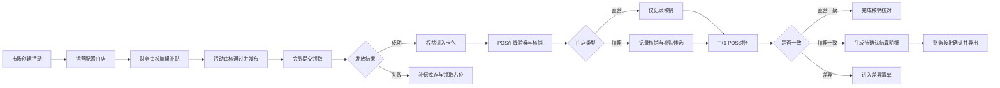

# 青禾茶饮会员营销平台

## 优惠券权益与门店履约模块 PRD v1.0

> 文档状态：一期产品需求基线（模拟项目）  
> 决策状态：核心业务口径已冻结，可进入 Mock 与开发  
> 冻结日期：2026-09-08（模拟）  
> 项目性质：青禾茶饮、组织、系统、门店和数据均为项目推演设定，不代表真实客户或上线经历  
> 负责范围：优惠券权益、会员领取、门店 POS 履约、撤销、对账及加盟补贴确认前明细  
> 关联文档：[需求基线](./青禾茶饮_一期需求基线_v1.0.md) · [接口设计](../contracts/青禾茶饮_一期接口设计说明_v1.0.md) · [技术方案](../technical/青禾茶饮_优惠券权益与门店履约模块技术方案_v0.1.md) · [开发计划](../management/青禾茶饮_一期开发任务拆分与估时_v0.1.md)

---

## 1. 文档目的

本文定义一期产品需要解决的业务问题、参与角色、业务流程、功能需求、状态规则、异常处理和验收标准。产品、开发、测试和模拟验收均以本文为业务依据。

本文回答系统应该做什么以及怎样算完成，不负责规定具体 Java 类、数据库索引、Redis Key、消息队列参数或部署拓扑；这些内容由技术方案负责。

本文中的“已确认”仅表示本次模拟项目内已经完成产品决策，不表示得到真实甲方、POS 厂商、会员中心或财务部门确认。

## 2. 产品背景

### 2.1 业务背景

青禾茶饮同时经营直营门店和加盟门店。总部希望通过既有小程序向会员发放免费领取型优惠券或指定商品权益，并允许试点门店通过既有 POS 在线验券和核销。

直营门店的优惠成本由总部内部承担，不形成加盟补贴；加盟门店替总部履约后，需要根据活动发布时冻结的补贴标准形成可核对的补贴明细。POS 日文件与平台核销记录完成 T+1 对账后，财务按批次确认补贴明细，再交由既有线下或 ERP 流程处理实际付款。

### 2.2 当前问题

现有点评秒杀工程具备 Redis 库存预扣、防重复领取、RabbitMQ 异步处理、失败重试和补偿等基础机制，但不能直接代表连锁品牌权益业务，主要缺少：

1. 请求受理、权益到账和用户卡包之间的明确业务状态；
2. 活动规则、适用门店、直营/加盟属性和补贴快照；
3. POS 验券、幂等核销、原结果查询和撤销；
4. 平台核销与 POS 日文件的对账；
5. 加盟补贴候选、待确认结算明细和财务批次确认；
6. 面向运营、客服和财务的异常查询与操作审计。

### 2.3 产品机会

在不重建小程序、会员中心、POS、ERP、点单和供应链的前提下，将现有高并发优惠券技术基础改造为一个可领取、可查询、可履约、可撤销、可对账和可审计的营销权益闭环。

## 3. 一期目标与成功定义

### 3.1 一期目标

在十家模拟试点门店中，跑通以下完整闭环：

```text
总部创建并审批免费券活动
→ 活动发布并冻结规则、门店、库存和加盟补贴
→ 会员提交领取申请并查询最终结果
→ 发放成功后权益进入会员卡包
→ 直营或加盟门店 POS 在线验券、核销和查询原结果
→ 合法核销支持当天原单撤销
→ 平台核销与全部试点门店的 POS T+1 文件对账
→ 加盟店一致记录进入待确认补贴批次
→ 财务按批次确认并导出，实际付款仍由外部流程完成
```

### 3.2 成功定义

| 目标 | 产品判断标准 |
|---|---|
| 权益可追踪 | 每次领取有申请号；受理、处理中、成功、失败均可查询 |
| 成功含义一致 | 只有权益已经创建且卡包可查，才显示领取成功 |
| 不重复发券 | 同一会员在同一活动最多成功领取一次；重复请求返回首次结果 |
| 门店履约可靠 | 同券并发核销最多一个成功；响应丢失后能按原请求号恢复结果 |
| 撤销可审计 | 原核销不删除，合法撤销有独立流水，非法撤销进入异常处理 |
| 对账不重不漏 | 重复文件不重复处理；冲突、坏行和差异不会进入正常结算 |
| 补贴口径清晰 | 直营店不产生补贴；加盟店按活动统一补贴快照生成候选 |
| 财务边界真实 | CONFIRMED 表示明细已确认，不表示加盟商已经收到付款 |

### 3.3 观测指标

一期定义指标口径，但不在没有执行证据时承诺生产数值：

- 活动曝光、领取请求、受理、成功、失败和补偿数量；
- 领取处理时长、卡在 PROCESSING/COMPENSATING 的数量；
- 验券、核销、重复请求、请求冲突和原结果查询数量；
- 同券并发冲突、撤销成功和撤销拒绝数量；
- 对账文件到达率、匹配率、差异量、坏行量和批次处理时长；
- 加盟补贴候选金额、待确认金额、已确认金额和冻结差异金额；
- 领取峰值期间 POS 接口延迟和错误率。

正式容量、SLA 和告警阈值在 Mock、集成和压测后确定。

## 4. 产品范围

### 4.1 一期纳入

1. 五家直营、五家加盟的十家模拟试点门店；
2. 免费领取型优惠券或指定商品权益；
3. 活动草稿、提交、审核、发布、到时生效、提前终止；
4. 活动门店范围、总库存、每会员限领一次和统一加盟补贴；
5. 审批式活动库存追加；
6. 会员身份校验、平台会话、领取申请、异步发放、结果查询和卡包；
7. POS 在线验券、核销、原结果查询和当天原单撤销；
8. 全部试点门店的 T+1 POS 文件导入和核销对账；
9. 加盟店补贴候选、待确认结算批次、财务批量确认和导出；
10. 异常查询、人工处理留痕、操作审计、指标和基础告警。

### 4.2 一期排除

1. 付费购券、支付、退款和资金清结算；
2. 重建小程序、会员中心、POS、ERP 或点单系统；
3. 原料、仓储、配送、制作、排班和外卖履约；
4. 离线核销、断网后先核销再补传；
5. 跨日自动撤销；
6. 自动 ERP 入账和自动向加盟商付款；
7. 历史优惠券全量迁移；
8. 多品牌、多币种、全国门店一次性切换；
9. 积分商城、会员成长和复杂营销自动化；
10. 博客、点赞、关注、Feed、签到等社区能力；
11. 为展示技术而引入微服务、分库分表、Kafka、Kubernetes 等无业务证据的改造。

### 4.3 一期边界解释

- 活动库存是营销权益额度，不是门店原料库存；
- 免费券表示会员无需支付购券款，不表示门店履约没有成本；
- 支持结算表示生成、确认和导出可追溯明细，不表示平台执行付款；
- 支持 POS 表示接入约定版本的在线接口，不表示改造所有 POS；
- Mock 通过表示模拟契约成立，不表示真实厂商联调或生产上线。

## 5. 用户与权限

| 角色 | 主要诉求 | 允许操作 | 禁止操作 |
|---|---|---|---|
| 市场人员 | 快速配置营销活动 | 创建模板和活动、配置规则、提交审核、查看效果 | 审核自己的活动、直接确认补贴批次 |
| 运营人员 | 管理门店范围和异常 | 导入门店、配置参加范围、发布已审核活动、查看和处理业务异常 | 修改已确认财务金额、绕过状态机改表 |
| 财务人员 | 控制加盟补贴口径 | 审核统一单张补贴、查看差异、按批确认、导出明细 | 修改用户权益或 POS 核销事实、在差异未处理时强行纳入正常批次 |
| 客服人员 | 回答用户和门店问题 | 按业务编号查询申请、权益、核销和异常 | 发券、核销、撤销、修改补贴或确认结算 |
| 系统管理员 | 维护安全和基础配置 | 配置外部凭证引用、角色、试点门店基础权限 | 以系统权限代替业务审批 |
| 会员用户 | 领取并使用权益 | 查看活动、领取、查询结果、查看卡包 | 指定可信会员号、直接修改权益状态 |
| POS 终端 | 完成门店履约 | 验券、核销、查询原结果、提交当天原单撤销 | 查询其他门店敏感数据、离线核销、生成新请求号猜测原结果 |

一期允许在模拟管理端合并部分操作入口，但审批人、操作人、操作时间和原因必须分别记录，不能因为是单人项目就删除权限边界。

## 6. 名词定义

| 名词 | 定义 |
|---|---|
| 权益模板 BenefitTemplate | 优惠内容、展示文案、有效期和使用规则的定义 |
| 营销活动 Campaign | 一次面向会员发放权益的运营活动 |
| 活动门店 CampaignStore | 某活动发布时冻结的适用门店及加盟补贴快照 |
| 活动库存 CampaignInventory | 活动可成功发放的权益总额度，不是商品原料库存 |
| 库存调整 InventoryAdjustment | 发布后经过独立审批形成的库存增加记录 |
| 领取申请 ClaimRequest | 会员一次领取请求的可查询业务记录 |
| 用户权益 MemberEntitlement | 已经真正发放到会员卡包、可使用或已终止的资产 |
| 核销 Redemption | POS 将一份可用权益变为已使用的业务事实 |
| 撤销 RedemptionReversal | 对原核销进行审计化逆向处理的独立事实 |
| 补贴候选 SubsidyCandidate | 加盟店核销时冻结的补贴候选，尚未对账、确认或付款 |
| 对账批次 ReconBatch | 一份 POS 日文件的导入和匹配过程 |
| 结算明细 SettlementDetail | 对账一致后生成、等待财务确认的加盟补贴明细 |
| 结算批次 SettlementBatch | 财务一次整体确认的一组无差异结算明细 |
| 请求号 | 调用方为一次业务操作生成并在重试时复用的稳定标识 |
| 请求摘要 | 对稳定业务字段规范化后得到的内容摘要，用于识别请求号被错误复用 |

## 7. 已冻结产品决策

| 编号 | 决策 | 产品规则 |
|---|---|---|
| PD-01 | 一期门店范围 | 十家模拟试点店，暂按五家直营、五家加盟 |
| PD-02 | 门店参加方式 | 直营店由总部统一配置；加盟店先线下确认，再按确认名单导入 |
| PD-03 | 直营补贴 | 直营店单张补贴固定为 0，核销时不生成 SubsidyCandidate |
| PD-04 | 加盟补贴 | 同一活动的全部加盟店使用同一单张补贴金额；发布时复制到各 CampaignStore 形成快照 |
| PD-05 | 对账范围 | 直营店和加盟店都参与 T+1 对账；只有加盟店一致记录进入补贴结算 |
| PD-06 | 库存追加 | SCHEDULED/ACTIVE 可申请增加，不得减少；保存独立审批与调整记录；ENDED/TERMINATED 不可追加 |
| PD-07 | 领取成功 | 只有 MemberEntitlement 已创建且卡包可查询，ClaimRequest 才能为 SUCCESS |
| PD-08 | POS 未知结果 | 超时或 5xx 后查询原请求；短间隔重查仍 NOT_FOUND 时，只能用原请求号和原内容重提 |
| PD-09 | 核销与补贴 | 加盟店成功核销在同一业务提交中形成 Redemption 和 SubsidyCandidate；直营店只形成 Redemption |
| PD-10 | 财务确认 | 对账差异先排除，财务按 SettlementBatch 整批确认，不逐条点击确认 |
| PD-11 | 确认边界 | CONFIRMED 只表示财务确认本平台明细，不表示 ERP 已入账或加盟商已收款 |
| PD-12 | 开发组织 | 同时只推进一个主要工作包；观测能力从领取阶段伴随建设，阻塞切换需要记录原因 |

核心决策发生变化时必须建立变更记录，说明原因、影响功能、数据迁移、测试和排期，不允许只修改某一张表或某一个接口。

## 8. 业务全景流程

### 8.1 主流程



### 8.2 关键业务原则

1. 用户点击成功不等于发券成功；
2. Redis 预留成功不等于发券成功；
3. 消息投递成功不等于发券成功；
4. 验券成功不锁定权益，也不保证稍后核销一定成功；
5. 核销成功不等于 POS 日文件对账一致；
6. 加盟补贴候选不等于待确认结算明细；
7. 财务确认不等于实际付款；
8. 所有外部系统的结果未知必须通过稳定请求号和对账恢复，不能靠猜测。

## 9. 功能需求

### 9.1 会员身份与平台会话

#### FR-ID-01 会员身份校验（P0）

**用户故事：** 作为会员，我希望使用既有小程序登录态访问活动，而不需要在新平台重复注册。

**业务规则：**

- 小程序传入的普通会员编号不得直接视为可信身份；
- 平台调用模拟会员中心校验 Token，并取得稳定外部会员编号和会员状态；
- 校验成功后建立短期平台会话；
- 会员不存在、冻结、Token 无效时不得领取；
- 外部超时必须与业务冻结区分，不能默认放行。

**验收标准：**

- AC-ID-01：有效 Token 可以建立平台会话并映射到唯一会员；
- AC-ID-02：相同外部会员不会重复创建不同平台身份；
- AC-ID-03：无效或冻结会员不能领取，返回稳定业务错误；
- AC-ID-04：会员中心超时返回临时失败，不产生领取申请和库存预留。

### 9.2 门店主数据与活动参加范围

#### FR-STORE-01 试点门店导入（P0）

**用户故事：** 作为运营人员，我希望导入已确认的试点门店，使活动、POS 和对账使用同一门店身份。

**业务规则：**

- 每家门店具有稳定外部门店编码、名称、直营/加盟属性、状态和 POS 版本；
- 相同版本文件重复导入不得重复创建门店；
- 相同门店编码的属性变化需要保留来源版本和变更记录；
- DISABLED 门店不能参加新活动或执行新核销；
- 已产生历史核销的门店不得物理删除。

**验收标准：**

- AC-STORE-01：可导入五家直营和五家加盟的模拟清单；
- AC-STORE-02：重复文件幂等，冲突数据输出明确错误行；
- AC-STORE-03：停用门店不能核销，历史记录仍可查询；
- AC-STORE-04：门店属性能够用于补贴和对账分支判断。

#### FR-STORE-02 活动门店范围（P1）

- 直营试点店由总部运营统一选择参加；
- 加盟试点店只能从已线下确认参加的名单中选择；
- 活动发布时冻结参加状态、门店类型和补贴快照；
- 活动开始后退出不能删除历史关系，应转为运营异常并记录原因。

### 9.3 权益模板

#### FR-TPL-01 模板创建与维护（P1）

**必填信息：** 模板编号、权益类型、名称、展示说明、使用规则、有效期类型、有效期值、状态。

一期支持：

- 免费领取型优惠券；
- 指定商品权益；
- 固定起止日期，或领取后 N 天有效，两者每个活动二选一。

模板被已发布活动引用后，不允许覆盖修改历史规则；需要变化时创建新版本。

### 9.4 营销活动、审批与发布

#### FR-CAM-01 创建活动（P0）

**用户故事：** 作为市场人员，我希望配置一场总部活动并提交审核。

**必填信息：**

- 活动编号、名称和说明；
- 权益模板；
- 领取开始、结束时间；
- 初始总库存；
- 每会员限领次数，一期固定为 1；
- 适用门店；
- 全部加盟店统一单张补贴金额；
- 创建人和业务用途。

#### FR-CAM-02 活动审批（P0）

```text
DRAFT → PENDING_APPROVAL
PENDING_APPROVAL → SCHEDULED
PENDING_APPROVAL → REJECTED
SCHEDULED → ACTIVE
ACTIVE → ENDED
ACTIVE → TERMINATED
```

**业务规则：**

- 提交前校验模板、时间、库存、门店和补贴完整性；
- 审核记录包含申请人、审核人、时间、结论和原因；
- 一期将业务范围与补贴审核形成可追溯审批，不允许创建人无记录自审；
- 到达开始时间后由系统幂等进入 ACTIVE；
- 到达结束时间后进入 ENDED；
- 提前终止不删除已领取、已核销和待对账事实。

#### FR-CAM-03 活动发布快照（P0）

发布时冻结：

- 权益展示和使用规则；
- 领取时间和每会员限制；
- 适用门店及当时直营/加盟属性；
- 加盟店统一补贴金额，并复制到每个加盟 CampaignStore；
- 直营 CampaignStore 的补贴金额固定为 0；
- 初始活动总库存。

已发布活动不得直接覆盖这些历史快照。

#### FR-CAM-04 库存追加（P1）

**用户故事：** 作为市场人员，我希望在活动效果良好时申请追加库存，并由审核人确认后生效。

**业务规则：**

- 仅 SCHEDULED 或 ACTIVE 活动可以申请；
- 只允许填写正数增量，不允许减少库存；
- 每次追加形成独立 InventoryAdjustment，包含增量、原因、申请人、审核人和时间；
- 审核通过后增加活动可用额度，不覆盖初始库存或既有调整；
- REJECTED、ENDED、TERMINATED 活动不能生效新的调整；
- 调整生效失败时不得出现数据库已审批而 Redis 可用量永久未增加且无人可见。

**验收标准：**

- AC-CAM-01：不完整活动不能提交；
- AC-CAM-02：重复发布不会重复初始化库存；
- AC-CAM-03：已发布规则不能直接编辑覆盖；
- AC-CAM-04：库存追加必须经过新审批且只能增加；
- AC-CAM-05：重复执行已通过调整不会重复增加库存；
- AC-CAM-06：直营店补贴为 0，所有加盟店快照金额相同。

### 9.5 会员领取与结果查询

#### FR-CLAIM-01 提交领取申请（P0）

**用户故事：** 作为会员，我希望点击领取后立即获得一个可查询的申请号，并最终知道是否真正到账。

**前置条件：** 平台会话有效、会员未冻结、活动处于 ACTIVE 领取窗口、会员未领取过且存在可预留库存。

**规则与结果：**

| 场景 | 对外结果 | 说明 |
|---|---|---|
| 首次受理 | PROCESSING + claimNo | 进入处理，不表示券已到账 |
| 相同请求重复提交 | 返回首次申请和当前状态 | 不重复预留和发券 |
| 相同请求号、内容变化 | REQUEST_CONFLICT | 客户端错误复用请求号 |
| 已领取成功 | ALREADY_CLAIMED | 返回原结果引用，不创建第二份权益 |
| 库存不足 | SOLD_OUT | 不创建成功权益 |
| 活动不可领取 | CAMPAIGN_NOT_ACTIVE | 区分未开始、已结束和已终止 |
| 身份依赖临时失败 | TEMPORARY_UNAVAILABLE | 不默认放行 |

小程序为一次领取意图生成稳定 requestId，超时重试必须复用原请求号和原业务内容。

#### FR-CLAIM-02 查询领取结果（P0）

```text
PROCESSING → SUCCESS
PROCESSING → COMPENSATING → FAILED
```

- SUCCESS 必须返回 entitlementNo，且卡包可查询对应权益；
- COMPENSATING 对会员仍展示“结果确认中”；
- FAILED 只有在库存和领取占位补偿完成后才成立；
- 客服可根据 claimNo 查询内部节点、失败原因和补偿状态。

**验收标准：**

- AC-CLAIM-01：同一会员并发领取同一活动最多一份成功权益；
- AC-CLAIM-02：相同 requestId 返回同一 claimNo；
- AC-CLAIM-03：相同 requestId 内容变化被拒绝且不改变首次结果；
- AC-CLAIM-04：SUCCESS 时卡包存在对应权益；
- AC-CLAIM-05：FAILED 时库存和占位已恢复并留下原因；
- AC-CLAIM-06：进程异常后的申请最终成功或补偿失败，不永久失踪。

### 9.6 用户卡包与权益详情

#### FR-ENT-01 卡包列表（P0）

会员可以分页查看自己的可用、已使用、已过期和已取消权益。列表显示名称、有效期、状态和简要适用范围，不返回其他会员数据或完整敏感券码。

#### FR-ENT-02 权益详情（P0）

详情显示权益编号、内容、使用规则、有效期、适用门店、当前状态、受保护的核销凭证，以及已使用时的门店和时间摘要。

```text
AVAILABLE → USED
AVAILABLE → EXPIRED
AVAILABLE → CANCELLED
USED → AVAILABLE    仅合法撤销且仍在有效期
USED → EXPIRED      撤销时已经过期
```

**验收标准：**

- AC-ENT-01：会员只能查询自己的权益；
- AC-ENT-02：过期任务重复执行不会改变已使用或已取消事实；
- AC-ENT-03：完整券码不出现在普通日志、列表和无权限查询中；
- AC-ENT-04：权益状态与最新有效核销或撤销事实一致。

### 9.7 POS 验券、核销与原结果查询

#### FR-POS-01 POS 接入身份（P0）

- 试点凭证按门店隔离；
- 请求携带 clientId、签名、时间戳和 nonce；
- 停用、过期或签名失败的凭证不能调用；
- 单店凭证可以独立吊销和轮换；
- POS 只能以自身门店身份履约。

#### FR-POS-02 在线验券（P0）

- 返回权益是否存在、是否可用、是否适用于本店、有效期和权益摘要；
- 验券只读，不锁券、不扣库存、不创建核销；
- 已使用、已过期、已取消、不适用本店返回不同稳定错误；
- 不返回完整手机号、Token 或无关个人信息。

#### FR-POS-03 在线核销（P0）

- 输入包含 posRequestNo、权益码、门店身份、POS 订单号、发生时间和约定业务字段；
- 相同请求号和相同摘要返回首次结果；
- 相同请求号但摘要不同返回 REQUEST_CONFLICT；
- 同一权益并发核销最多一个成功；
- 成功核销创建 Redemption 并将权益变为 USED；
- 直营店成功核销不生成 SubsidyCandidate；
- 加盟店成功核销同时生成 SubsidyCandidate(UNRECONCILED)，金额取发布快照；
- 核销成功不表示补贴已对账、确认或付款。

#### FR-POS-04 查询原核销结果（P0）

- POS 可按原 posRequestNo 查询首次结果；
- 超时、5xx 或连接中断后先查询；
- NOT_FOUND 时进行短间隔有限重查；
- 仍为 NOT_FOUND 时只允许用相同原请求号和原内容重提；
- 禁止生成新请求号恢复同一未知操作。

**验收标准：**

- AC-POS-01：重复请求不生成第二条核销；
- AC-POS-02：请求号冲突不改变权益和首次结果；
- AC-POS-03：同券并发核销只有一个 SUCCESS；
- AC-POS-04：响应丢失后可查询原 redemptionNo；
- AC-POS-05：直营无补贴候选，加盟候选金额等于发布快照；
- AC-POS-06：A 门店凭证不能替 B 门店核销；
- AC-POS-07：领取峰值下 POS 有独立指标和保护验证。

### 9.8 当天原单撤销

#### FR-REV-01 撤销核销（P1）

**前置条件：** 请求来自原门店、引用原核销、原核销尚未撤销、发生在同一业务自然日，且结算尚未确认或锁定。

**处理规则：**

- 创建独立 RedemptionReversal，不删除原 Redemption；
- 原核销变为 REVERSED；
- 权益仍有效则恢复 AVAILABLE，否则变为 EXPIRED；
- 加盟店未确认 SubsidyCandidate 变为 CANCELLED；
- 已生成但尚未确认的 SettlementDetail 同步变为 CANCELLED，并从待确认批次中排除或触发批次重建；
- 相同撤销请求返回首次结果；
- 跨日、已确认、门店不一致等情况拒绝自动撤销并进入差异处理。

**验收标准：**

- AC-REV-01：合法撤销保留原核销和撤销事实；
- AC-REV-02：重复撤销不重复恢复权益；
- AC-REV-03：过期权益不会恢复为可用；
- AC-REV-04：已确认明细不能被自动撤销覆盖；
- AC-REV-05：加盟候选随合法撤销取消，直营流程不产生空候选。

### 9.9 T+1 对账

#### FR-RECON-01 文件接收与幂等（P0）

- 全部试点门店每日提供前一自然日文件；
- 零交易提供合法空文件，文件缺失不能解释为零交易；
- 文件包含提供方、业务日期、批次号、版本和 checksum；
- 相同文件重复到达返回原批次结果；
- 同批次号但 checksum 不同标记冲突并阻断；
- 更正通过新批次表达，不覆盖历史文件。

#### FR-RECON-02 分块导入（P1）

- 文件分块解析并保存进度；
- 同一批次行号唯一；
- 坏行保留行号、原因和原始摘要；
- 中断后可从已完成块继续；
- 汇总或结构不合法时不得进入可结算状态。

#### FR-RECON-03 核销匹配（P0）

| 平台记录 | POS 记录 | 结果 |
|---|---|---|
| 成功 | 成功且关键字段一致 | MATCHED |
| 成功 | 缺失 | DIFFERENCE_PLATFORM_ONLY |
| 缺失 | 成功 | DIFFERENCE_POS_ONLY |
| 成功 | 失败或撤销状态冲突 | DIFFERENCE_STATUS |
| 金额、门店或映射冲突 | 任意 | DIFFERENCE_DATA |
| 双方撤销一致 | 撤销一致 | MATCHED_REVERSAL |

- 直营店 MATCHED 只完成履约核对，不生成补贴明细；
- 加盟店 MATCHED 后将候选置为 MATCHED，并生成 SettlementDetail(PENDING_CONFIRM)；
- DIFFERENCE 进入差异清单，不生成正常结算明细；
- 对账不得直接修改会员权益状态。

**验收标准：**

- AC-RECON-01：重复文件不重复导入、匹配或生成明细；
- AC-RECON-02：同批次不同内容被阻断；
- AC-RECON-03：空文件与缺失文件语义不同；
- AC-RECON-04：坏行和汇总错误可定位；
- AC-RECON-05：直营匹配不产生补贴，加盟匹配仅一条有效明细；
- AC-RECON-06：差异可按日期、活动、门店和业务编号查询。

### 9.10 结算批次、财务确认与导出

#### FR-SET-01 生成待确认批次（P0）

- 一个已完成核对的 ReconBatch 可生成一个对应 SettlementBatch；
- 仅纳入加盟店、MATCHED、未撤销、未进入其他批次的 SettlementDetail；
- 直营记录和所有差异记录排除在补贴批次之外；
- 批次保存业务日期、来源对账批次、门店数、明细数、总金额和生成时间；
- 相同来源重复生成返回原批次，不重复累计金额。
- 来源批次没有合格加盟明细时不创建空结算批次，只记录“对账完成、无需补贴结算”。

#### FR-SET-02 财务整批确认（P0）

**用户故事：** 作为财务人员，我希望检查批次汇总和明细后一次确认整批数据，而不是逐笔点击。

- 财务可查看批次汇总、加盟门店分组、活动分组和明细；
- 确认前再次校验批次未变化、明细仍满足条件；
- 确认操作记录确认人、时间、批次版本和备注；
- 确认后批次和明细变为 CONFIRMED；
- CONFIRMED 金额不可覆盖；后续问题通过调整或人工差异表达；
- 本系统不提供“已付款”按钮，不推断 ERP 或银行结果。

#### FR-SET-03 导出复核明细（P1）

导出至少包含批次号、业务日期、活动、加盟门店、核销号、POS 请求号、补贴金额、对账状态、确认状态和必要审计字段，不包含完整 Token、密钥或完整敏感券码。

**验收标准：**

- AC-SET-01：差异、直营、已撤销记录不进入补贴批次；
- AC-SET-02：重复生成或重复确认不会重复金额；
- AC-SET-03：确认后历史金额不能直接修改；
- AC-SET-04：批次汇总等于其有效明细汇总；
- AC-SET-05：导出可以追溯到来源对账批次和核销；
- AC-SET-06：页面和导出不把 CONFIRMED 表述为已付款。

### 9.11 运营异常、客服查询与审计

#### FR-OPS-01 统一业务查询（P1）

授权人员可使用以下任一编号定位业务链路：

```text
claimNo
eventId
entitlementNo
posRequestNo
redemptionNo
reconBatchNo
settlementBatchNo
```

查询结果按时间展示申请、消息、权益、核销、撤销、对账和结算之间的关联，不要求客服理解数据库主键。

#### FR-OPS-02 异常清单（P1）

至少提供：

- 长时间 PROCESSING 的领取申请；
- COMPENSATING 卡住或补偿失败；
- Redis 孤儿预留；
- Outbox DEAD 和消息死信；
- POS 结果未知与请求冲突；
- 撤销被拒绝；
- 文件缺失、批次冲突、坏行和对账差异；
- 待确认批次异常变化。

#### FR-OPS-03 人工处理与审计（P1）

- 人工处理只能执行预定义动作，不提供通用改表入口；
- 每次操作记录操作者、角色、原因、操作前后状态、业务编号和 traceId；
- 财务事实、原核销、原撤销和原文件不能物理删除；
- 客服只能查询，不能直接发券、核销、撤销或确认金额。

## 10. 产品页面与接口能力清单

### 10.1 管理侧页面

| 页面/入口 | 主要能力 | 一期要求 |
|---|---|---|
| 门店列表与导入 | 查询、导入、冲突报告、停用状态 | 必须 |
| 权益模板 | 新建、查看、版本化 | 必须 |
| 活动列表 | 按状态、时间查询 | 必须 |
| 活动创建/详情 | 规则、门店、库存、统一加盟补贴 | 必须 |
| 活动审批 | 审核、驳回、原因记录 | 必须 |
| 库存追加 | 申请、审批、调整历史 | 必须 |
| 领取与卡包查询 | 按会员/申请/权益编号查询 | 必须 |
| 核销与撤销查询 | 原请求、首次结果、撤销关系 | 必须 |
| 对账批次 | 文件状态、进度、坏行、汇总 | 必须 |
| 差异清单 | 查询、分类、处理记录 | 必须 |
| 结算批次 | 汇总、明细、整批确认、导出 | 必须 |
| 审计查询 | 关键人工操作 | 必须 |

一期可以用后端 API、简单管理页或可复查脚本承载管理能力，不要求重建完整视觉后台，但功能和权限语义不能省略。

### 10.2 会员侧能力

| 能力 | 产品结果 |
|---|---|
| 建立会话 | 会员身份校验成功后取得短期平台会话 |
| 活动列表/详情 | 只展示当前可见活动、规则和适用范围 |
| 提交领取 | 返回 claimNo 和 PROCESSING/已有终态 |
| 查询领取结果 | 返回 PROCESSING/SUCCESS/FAILED |
| 卡包列表 | 按状态分页展示本人的权益 |
| 权益详情 | 展示规则、门店、有效期和受保护凭证 |

### 10.3 POS OpenAPI 能力

| 能力 | 产品结果 |
|---|---|
| 验券 | 返回当前可用性快照，不锁券 |
| 核销 | 幂等改变权益状态并返回 redemptionNo |
| 查询原结果 | 按原 posRequestNo 恢复首次结果 |
| 当天撤销 | 合法时生成独立撤销结果 |

具体字段和错误码以 [POS 模拟契约](../contracts/pos-rights-api-v0.1.yaml) 为准；PRD 的业务语义优先，字段调整不得破坏这些语义。

## 11. 状态规则

### 11.1 活动

```text
DRAFT → PENDING_APPROVAL → SCHEDULED → ACTIVE → ENDED
                         ↘ REJECTED
ACTIVE → TERMINATED
```

### 11.2 库存调整

```text
DRAFT → PENDING_APPROVAL → APPROVED → APPLIED
                         ↘ REJECTED
APPROVED → APPLY_FAILED → APPLIED
```

APPROVED 不等于已经增加可领取库存；只有 APPLIED 才表示调整已生效。

### 11.3 领取申请

```text
PROCESSING → SUCCESS
PROCESSING → COMPENSATING → FAILED
```

### 11.4 用户权益

```text
AVAILABLE → USED / EXPIRED / CANCELLED
USED → AVAILABLE / EXPIRED    仅合法撤销
```

### 11.5 核销与撤销

```text
Redemption: PROCESSING → SUCCESS → REVERSED
                       ↘ FAILED

Reversal: PROCESSING → SUCCESS
                     ↘ REJECTED / FAILED
```

### 11.6 补贴候选、结算明细和批次

```text
SubsidyCandidate:
UNRECONCILED → MATCHED
             ↘ DIFFERENCE
UNRECONCILED / MATCHED → CANCELLED    合法撤销且未锁定

SettlementDetail:
PENDING_CONFIRM → CONFIRMED
PENDING_CONFIRM → CANCELLED    合法撤销或确认前剔除

SettlementBatch:
DRAFT → PENDING_CONFIRM → CONFIRMED
```

状态只能由拥有该业务动作的服务迁移；查询页面和人工脚本不得绕过规则直接改终态。

## 12. 异常与恢复规则

| 异常 | 用户/调用方看到什么 | 平台动作 | 禁止动作 |
|---|---|---|---|
| 会员中心超时 | TEMPORARY_UNAVAILABLE | 有限重试或稍后重试 | 默认会员有效 |
| Redis 预留后申请落库失败 | 失败或结果确认中 | 请求线程补偿，扫描兜底 | 无记录丢弃预留 |
| Outbox 投递失败 | PROCESSING | 退避重试，耗尽后进入补偿 | 将投递 ACK 当发券成功 |
| 消息重复或迟到 | 返回已有终态 | 状态门闩和幂等处理 | 重复创建权益 |
| 补偿中进程中断 | 结果确认中 | 扫描 COMPENSATING 并续跑 | 提前标记 FAILED |
| POS 业务冲突 | 稳定错误码 | 权益保持原状态 | 以新请求号强行重试 |
| POS 响应丢失 | 结果未知 | 查询原请求并返回首次结果 | 盲目再次核销 |
| 同券并发核销 | 一个成功，其余失败/已使用 | 条件更新 | 产生多条成功核销 |
| 撤销跨日或已锁定 | 拒绝自动撤销 | 进入差异清单 | 覆盖历史结算 |
| 对账文件缺失 | 等待并告警 | 请求补传 | 当作零交易 |
| 同批次内容变化 | 批次冲突 | 阻断并要求更正批次 | 覆盖原文件 |
| 文件部分坏行 | 批次失败或部分失败 | 输出错误行并续跑/更正 | 忽略坏行后正常结算 |
| 财务确认时批次变化 | 确认失败 | 重新核对版本和汇总 | 按旧金额确认 |

## 13. 外部系统与数据权威

| 数据/能力 | 权威来源 | 本模块责任 | 模拟状态 |
|---|---|---|---|
| 会员身份和冻结状态 | 会员中心 | 校验、映射、短期会话 | 模拟契约，待 Mock |
| 小程序页面 | 既有小程序 | 提供会员侧 API | 不重建页面工程 |
| 门店主数据 | 确认文件/门店系统 | 版本化导入试点副本 | 模拟文件 |
| 活动与权益规则 | 本模块 | 保存完整事实和发布快照 | 本项目实现 |
| 用户权益 | 本模块 | 保存完整生命周期 | 本项目实现 |
| POS 收银交易 | POS | 保存核销映射和日文件摘要 | 模拟契约和文件 |
| 平台核销结果 | 本模块 | 保存原结果和撤销 | 本项目实现 |
| 加盟补贴明细 | 本模块 | 候选、对账、确认、导出 | 本项目实现至确认 |
| 实际入账和付款 | ERP/财务 | 不执行，只保留导出边界 | 一期无接口 |

## 14. 非功能需求

### 14.1 一致性与幂等

- 领取、发券、核销、撤销、文件导入、匹配、批次生成和库存追加均需幂等；
- RabbitMQ 按至少一次投递考虑，业务保证重复消息不重复生效；
- MySQL 保存最终业务事实，Redis 只用于加速、预留和短期协调；
- 任意最终状态都能追溯到业务编号和来源事实。

### 14.2 性能与资源保护

- 不沿用旧点评秒杀数字作为青禾成果；
- 新领取链路加入 ClaimRequest、Outbox 和结果查询后重新压测；
- 领取与 POS 使用独立限流、线程资源和指标；
- 活动高峰允许领取快速拒绝，但不能无边界挤占 POS 履约能力；
- 报告至少记录环境、数据规模、并发模型、P95/P99 和错误率。

### 14.3 安全与隐私

- 会员、管理和 POS 使用不同认证边界；
- POS 凭证按门店隔离，支持轮换和吊销；
- Token、密钥、签名、手机号和完整券码不得写普通日志；
- 生产凭证不得进入仓库；
- 防重放、越权、请求篡改和敏感数据导出需要测试。

### 14.4 可观测与审计

- 领取、消息、补偿、POS、撤销、对账和结算有独立指标；
- 关键告警关联责任人、查询入口和恢复动作；
- 人工处理保存操作前后状态、原因和操作者；
- 模拟验证、真实联调和生产运行证据必须明确区分。

### 14.5 可迁移与回滚

- 新业务使用 qh_ 表和新接口命名空间；
- 已发权益、已核销记录、已导入文件和已确认金额不得通过回滚删除；
- 回滚前处理未终态领取、Outbox、消息和补偿任务；
- 破坏性结构删除放在独立版本，不与一期首次发布同时进行。

## 15. 模拟验收方案

### 15.1 验收阶段

| 阶段 | 目的 | 进入条件 | 退出条件 |
|---|---|---|---|
| 契约验证 | 确认接口格式和错误语义可执行 | PRD 和模拟契约冻结 | Mock 可启动，契约可解析，测试骨架可运行 |
| 模块验收 | 验证每个业务包正常、重复、失败路径 | 对应工作包实现完成 | 对应 AC 全部有结果，失败项已处理或接受 |
| 端到端验收 | 验证完整业务闭环 | 领取、POS、对账链路完成 | 活动到结算确认可重复演示 |
| 故障验收 | 验证超时、崩溃、重复和恢复 | 集成环境可控注入故障 | 无重复权益、重复核销、库存无主或金额覆盖 |
| 模拟试点验收 | 验证十家门店数据和权限边界 | 前四阶段通过 | 验收记录完整，不冒充真实生产上线 |

### 15.2 核心 UAT 场景

| 编号 | 场景 | 预期结果 |
|---|---|---|
| UAT-01 | 创建含直营和加盟店的免费券活动 | 规则完整，可提交审核 |
| UAT-02 | 活动缺少加盟补贴或门店 | 不能发布，指出缺失项 |
| UAT-03 | 活动发布 | 规则、门店、补贴、初始库存形成快照 |
| UAT-04 | ACTIVE 活动审批追加库存 | 只增加一次，原始值和调整记录均保留 |
| UAT-05 | 同会员重复领取 | 最多一份成功权益，返回原申请/结果 |
| UAT-06 | 发券消息重复 | 不重复创建权益 |
| UAT-07 | 发券失败并补偿 | 最终 FAILED，库存与占位恢复 |
| UAT-08 | 会员查看卡包 | SUCCESS 权益可查，其他会员不可查 |
| UAT-09 | POS 验券 | 返回快照但不锁券、不改状态 |
| UAT-10 | 同券并发核销 | 一个成功，其余返回稳定非成功结果 |
| UAT-11 | 加盟店核销 | 创建核销和统一金额补贴候选 |
| UAT-12 | 直营店核销 | 创建核销，不创建补贴候选 |
| UAT-13 | POS 核销响应丢失 | 用原请求号查询首次成功结果 |
| UAT-14 | 原结果仍 NOT_FOUND 后重提 | 相同请求号和内容安全执行/返回首次结果 |
| UAT-15 | 合法当天撤销 | 保留原核销，恢复/过期权益，取消加盟候选 |
| UAT-16 | 跨日或已确认后撤销 | 拒绝自动处理并进入差异清单 |
| UAT-17 | 直营店日文件对账一致 | 标记匹配，不生成补贴明细 |
| UAT-18 | 加盟店日文件对账一致 | 生成一条 PENDING_CONFIRM 明细 |
| UAT-19 | 文件重复上传 | 返回原批次，不重复生成明细 |
| UAT-20 | 同批次不同 checksum | 标记冲突并阻断结算 |
| UAT-21 | 文件缺失与合法空文件 | 缺失告警；空文件按零交易处理 |
| UAT-22 | 对账状态或金额差异 | 进入差异清单，不进入正常批次 |
| UAT-23 | 财务确认结算批次 | 合法明细整批 CONFIRMED，汇总一致 |
| UAT-24 | 重复确认同一批次 | 幂等返回原结果，不重复金额 |
| UAT-25 | 导出确认明细 | 可追溯，不显示为已付款，不泄露敏感字段 |
| UAT-26 | 领取高峰与 POS 混合压测 | 分别记录指标，验证 POS 资源保护 |

详细接口 PoC 见 [接口 PoC 验收用例](../contracts/接口PoC验收用例_v0.1.md)。当前未执行的用例继续保持 NOT_RUN，只有真实执行后才能改为 PASS/FAIL。

## 16. 需求追踪矩阵

| 需求域 | 功能编号 | 主要工作包 | 核心验收 |
|---|---|---|---|
| 身份 | FR-ID-01 | WP-00、WP-02 | AC-ID-01～04 |
| 门店 | FR-STORE-01～02 | WP-02、WP-03 | AC-STORE-01～04 |
| 模板与活动 | FR-TPL-01、FR-CAM-01～04 | WP-03 | AC-CAM-01～06 |
| 领取 | FR-CLAIM-01～02 | WP-04、WP-05 | AC-CLAIM-01～06 |
| 卡包 | FR-ENT-01～02 | WP-05 | AC-ENT-01～04 |
| POS | FR-POS-01～04 | WP-06 | AC-POS-01～07 |
| 撤销 | FR-REV-01 | WP-07 | AC-REV-01～05 |
| 对账 | FR-RECON-01～03 | WP-08 | AC-RECON-01～06 |
| 结算 | FR-SET-01～03 | WP-08 | AC-SET-01～06 |
| 运营与审计 | FR-OPS-01～03 | WP-04 起伴随 WP-09 | 故障可查、操作可审计 |
| 系统验证 | 全部 | WP-10 | UAT-01～26、PoC 实际结果 |
| 旧入口隔离 | 产品排除范围 | WP-11 | 青禾入口不展示点评社区能力 |

说明：WP-00 只要求 Mock、契约校验和测试骨架可运行。POS 幂等、响应丢失和同券并发等行为测试，在 WP-06 实现后才能转为通过，并在 WP-10 做组合验证。

## 17. 依赖、风险与产品应对

| 依赖/风险 | 产品影响 | 当前应对 |
|---|---|---|
| 会员中心契约是模拟的 | 身份失败语义可能变化 | 用适配器和 Mock 隔离，不声称真实联调 |
| POS 必须保存原请求号 | 未知结果无法安全恢复 | 作为试点准入条件，旧版本不纳入试点 |
| 对账 CSV 尚无真实样例 | 字段和更正规则可能返工 | 冻结模拟版本样例，解析与领域匹配分离 |
| 领取链路新增同步业务记录 | 峰值能力未知 | 新链路压测，不引用旧秒杀数字 |
| 加盟补贴存在财务争议 | 无法确认结算 | 一期统一活动金额、发布快照、差异排除、批次确认 |
| 库存追加跨数据库和 Redis | 可能重复增加或不同步 | 独立调整编号、幂等生效和异常查询 |
| 旧点评入口仍存在 | 项目边界被误解 | 新命名空间运行，最终配置化停止暴露旧入口 |
| 方案被写成真实客户项目 | 简历诚信风险 | 全文保留模拟声明，以代码和测试描述个人项目改造 |

## 18. 尚待技术实现阶段确定

以下不改变产品规则，可在对应工作包内完成设计并记录：

1. 平台会话的具体有效期和续期方式；
2. 会员冻结是否通过推送主动失效会话；
3. 券码生成、加密、展示和防截图策略；
4. 对账文件最终签名、加密、编码和字段长度；
5. 业务数据、日志、文件和审计记录保留期限；
6. 正式容量目标、SLA 和告警阈值；
7. 结算批次编号、导出模板样式和财务备注字段；
8. 活动补贴金额为 0 的加盟活动是否允许发布；默认允许，但必须明确展示为 0 元补贴并经过财务审核。

技术实现不得借这些待定项改变已经冻结的业务含义。如需改变，必须走第 19 节的需求变更流程。

## 19. 需求变更规则

### 19.1 必须发起变更的情况

- 新增付费券、支付、退款、离线核销或自动付款；
- 改变每会员限领次数；
- 允许活动发布后减少库存；
- 允许不同加盟门店使用不同补贴金额；
- 改变跨日撤销或结算锁规则；
- POS 无法保持原请求号；
- 对账来源、匹配口径或财务确认粒度变化；
- 新增真实外部系统或生产 SLA。

### 19.2 变更记录至少包含

```text
变更原因
原需求与新需求
影响角色和业务流程
数据与历史记录处理
接口、状态和权限影响
测试与验收影响
开发工作量和排期影响
决策人和生效版本
```

没有记录的口头变化不进入一期实现。

## 20. 交付边界与诚实说明

一期交付完成需要同时具备：

- 可运行的青禾新业务代码；
- 可重复的 Mock、契约、模块和端到端测试；
- 领取、补偿、POS 未知结果、撤销、对账和批次确认的证据；
- 可执行的初始化、迁移、故障排查和回滚说明；
- 与代码真实状态一致的 README；
- 已实现能力和未实现边界清单。

在上述证据形成前：

- PRD 不表示功能已经实现；
- 模拟验收不表示真实客户验收；
- Mock 不表示真实厂商联调；
- 压测计划不表示已达到性能指标；
- CONFIRMED 不表示实际付款；
- 不在简历中声称尚未完成的 POS、对账、结算或生产上线成果。

## 21. 当前结论

本 PRD 已将一期业务目标、范围、角色、主流程、直营/加盟补贴、库存追加、会员领取、卡包、POS 履约、撤销、T+1 对账、财务批次确认、异常处理、非功能要求和验收标准统一为一份产品基线。

当前状态：

```text
产品需求基线：FROZEN（模拟）
技术方案：修改后通过（模拟）
开发任务拆分：DONE（规划）
业务代码：IN_PROGRESS（WP-00 至 WP-09 DONE）
PoC：NOT_RUN
真实外部联调：NOT_APPLICABLE
生产上线：NOT_STARTED
```

WP-00 至 WP-09 已建立可控 Mock、领域工程、活动领取、异步发券、卡包、POS 履约、当天撤销、T+1 对账、结算复核和运营故障定位的本地模拟实现与自动化证据；下一项为 WP-10 系统验证与发布演练。尚未执行的系统级 PoC、外部联调和生产上线仍不得写成完成态。
