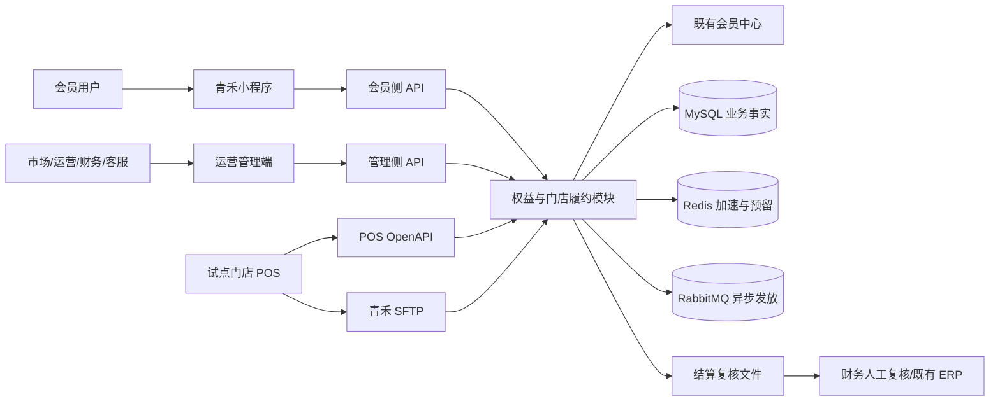
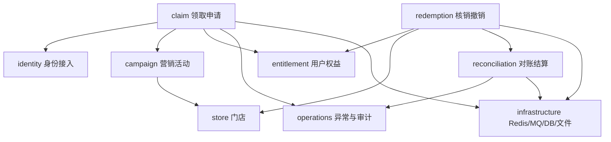
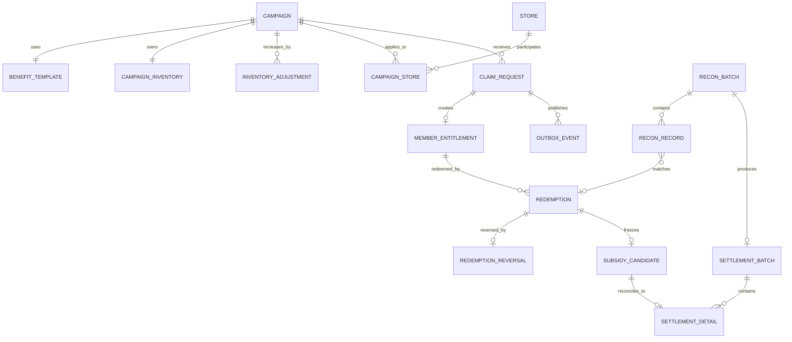
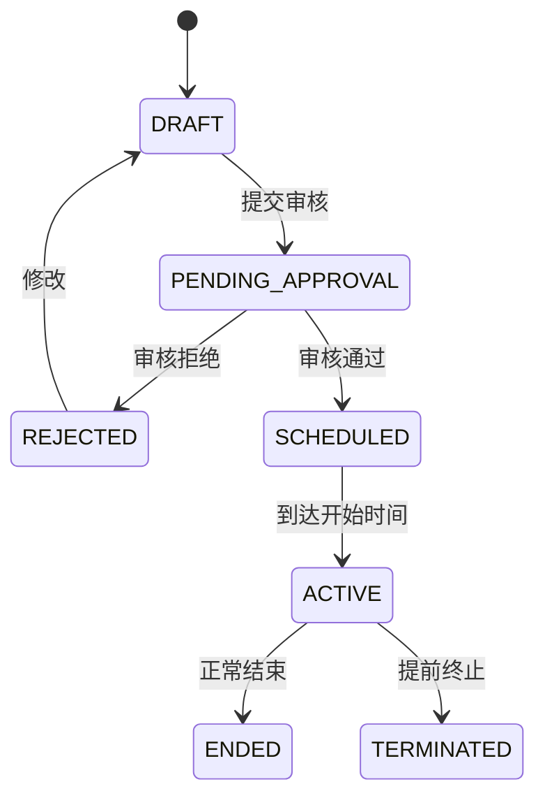
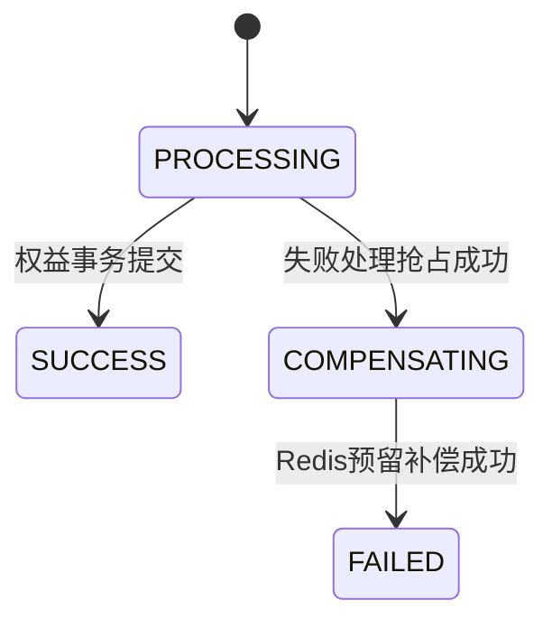
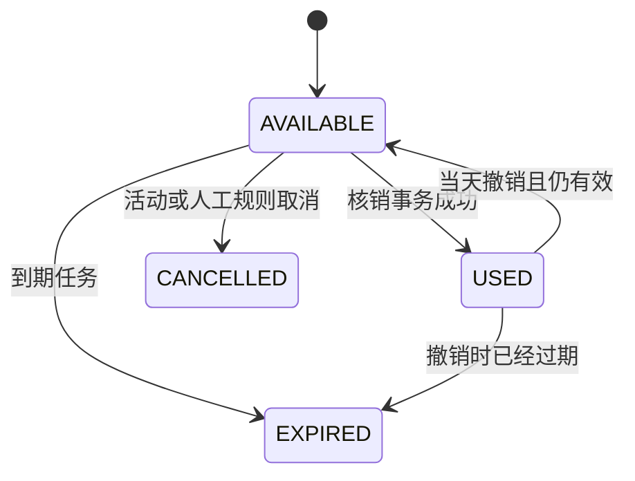
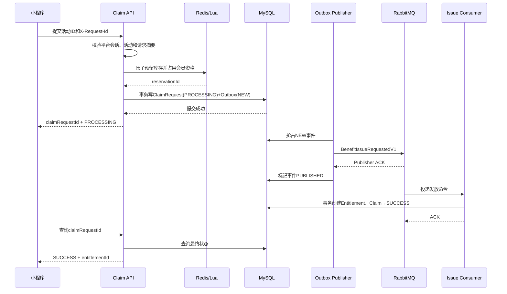
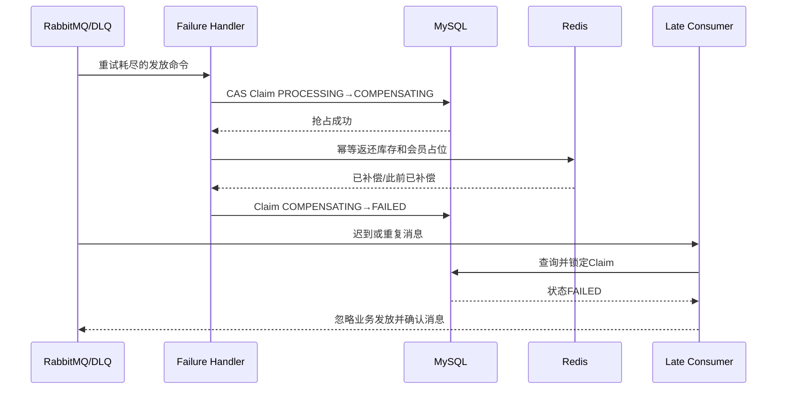
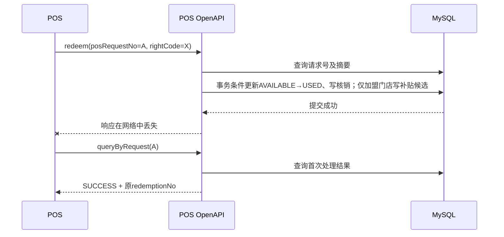

# 青禾茶饮会员营销平台

## 优惠券权益与门店履约模块技术方案 v0.1（评审修改版）

> 文档状态：模拟技术评审“修改后通过”，评审意见已回写  
> 当前阶段：技术基线已冻结，WP-00 至 WP-05 已完成
> 适用阶段：一期设计评审，不作为已经实现或已经上线的证明  
> 项目性质：“青禾茶饮”及其外部系统均为模拟企业场景  
> 设计目标：在复用现有工程基础的同时，完成从点评秒杀订单到连锁品牌营销权益履约的领域改造

---

## 1. 评审目标

本次评审需要决定：

1. 一期是否采用模块化单体，而不是立即拆分微服务；
2. 活动、领取申请、用户权益、核销和结算是否按独立生命周期建模；
3. Redis 预留、MySQL 业务状态、RabbitMQ 异步发放和失败补偿如何闭环；
4. POS 重复请求、响应丢失、撤销和对账差异如何处理；
5. 现有代码哪些保留、改造、隔离和停止暴露；
6. 当前方案是否已经达到可拆分开发任务的程度。

本次评审不决定：

- 真实厂商的正式接口地址、密钥和生产 SLA；
- 尚未执行的性能数字；
- 二期付费券、离线核销、ERP 自动入账和全部门店推广；
- 真实甲方合同、报价和项目经历。

## 2. 输入文档

- [完整 PRD v1.0](../product/青禾茶饮_优惠券权益与门店履约模块_PRD_v1.0.md)
- [一期需求基线](../product/青禾茶饮_一期需求基线_v1.0.md)
- [一期接口设计说明 v1.0](../contracts/青禾茶饮_一期接口设计说明_v1.0.md)
- [现有代码复用映射](./一期需求_现有代码复用映射_v0.1.md)
- [外部系统接口需求清单](./外部系统接口需求清单_v0.1.md)
- [会员中心模拟契约](../contracts/member-center-api-v0.1.yaml)
- [POS 与权益履约模拟契约](../contracts/pos-rights-api-v0.1.yaml)
- [接口 PoC 验收用例](../contracts/接口PoC验收用例_v0.1.md)

若本方案与完整 PRD 冲突，以完整 PRD 为准；若模拟契约经过 PoC 后发生变化，本方案需要同步更新。

---

## 3. 现状与主要问题

### 3.1 当前工程

当前项目是基于 Java 8、Spring Boot 2.3、MyBatis-Plus、MySQL、Redis、Redisson 和 RabbitMQ 的单体应用，已有：

- 用户登录、访问令牌和刷新令牌；
- 商户信息、缓存、GEO 和布隆过滤器；
- 优惠券及秒杀库存；
- Lua 库存预扣和一人一单；
- 请求幂等、令牌桶限流；
- RabbitMQ 生产确认、退回、重试、死信和 Redis 补偿；
- 数据库唯一约束及库存、订单本地事务。

### 3.2 当前实现不能直接满足一期的原因

1. 项目领域仍是商户点评、内容互动和秒杀订单，不是连锁品牌会员权益；
2. `Voucher` 只关联单个 `shopId`，不能表达总部活动和多门店范围；
3. `VoucherOrder` 同时预留支付、核销和退款状态，却没有相应业务闭环；
4. 异步抢券返回 `orderId` 后，请求幂等记录即写为 `SUCCESS`，此时数据库订单可能尚未生成；
5. Publisher ACK 只能证明 Broker 接收消息，不能证明用户权益已经到账；
6. 失败补偿主要恢复 Redis 库存和用户占位，没有领取申请终态和用户查询闭环；
7. 当前没有用户卡包、POS 验券核销、撤销、对账和加盟补贴；
8. 核心抢券、消息、重试和补偿集中在一个服务中，职责过多；
9. 原始 SQL 以整库初始化为主，正式演进需要可重复执行的增量迁移；
10. 旧项目性能数字不能直接代表新业务链路。

---

## 4. 总体架构决策

### ADR-01：一期采用模块化单体

**决定：** 保持单个 Spring Boot 应用和单个业务数据库，通过包、接口和表边界拆分模块；不在一期拆微服务。

**理由：**

- 当前工程、团队和试点范围均适合单体演进；
- 活动、权益、核销和结算之间事务关系尚在建立；
- 微服务会提前引入服务治理、分布式事务和多环境运维成本；
- 模块化单体仍能通过适配器和应用服务保持边界，未来有真实规模证据时再拆分。

**代价：**

- 需要代码评审约束模块依赖，不能继续让一个服务访问全部表；
- 定时任务和消息消费在多实例部署时仍需实现抢占和幂等。

### ADR-02：MySQL 保存业务事实，Redis 负责加速与短期协调

**决定：** 活动、领取申请、用户权益、核销和结算的最终业务事实保存在 MySQL。Redis 用于会话、限流、库存预留、热点状态和幂等加速，不作为唯一审计来源。

**理由：** 财务对账、客服查询和状态追踪需要可持久查询、可约束和可恢复的数据。

### ADR-03：领取申请与用户权益分离

**决定：** 请求被受理后创建领取申请；只有异步发放事务成功后才创建用户权益并将申请置为成功。

```text
请求受理成功 != 权益发放成功
领取申请 SUCCESS <=> 对应用户权益已经存在
```

### ADR-04：不使用分布式事务覆盖 POS

**决定：** 平台内部使用本地事务、唯一约束、条件更新、事务消息表和补偿；与 POS 之间使用稳定请求号、原结果查询和每日对账解决未知结果。

**理由：** 外部 POS 不参加我方数据库事务，强行使用 XA 不能解决门店网络和响应丢失问题。

### ADR-05：异步发放采用“Redis 预留 + 领取申请/Outbox + RabbitMQ”

**推荐方案：**

1. Lua 原子完成库存预留和每活动每会员一次校验；
2. 预留成功后，在同一 MySQL 事务中写入 `claim_request(PROCESSING)` 与 `outbox_event(NEW)`；
3. Outbox 发布任务向 RabbitMQ 投递发放命令，Publisher ACK 只更新消息投递状态；
4. 消费者在本地事务中创建用户权益并更新领取申请为 `SUCCESS`；成功权益记录本身是发放事实，不在活动单行上同步累计热计数；
5. 重试耗尽后，通过领取申请状态抢占补偿权，先进入 `COMPENSATING`，完成 Redis 补偿后再进入 `FAILED`；
6. Outbox `DEAD` 与 RabbitMQ/DLQ 重试耗尽统一进入同一失败处理器，迟到消息发现申请已是 `FAILED` 时不得再次创建权益；
7. 预留记录必须携带 `reservationId`，超时扫描任务负责发现“Redis 已预留但 MySQL 无有效申请”的孤儿预留，并执行幂等补偿；
8. RabbitMQ 只按至少一次投递设计，业务通过申请状态门闩、唯一约束和消费幂等实现“一次生效”，不声明基础设施 Exactly Once。

**仍需验证：** 成功预留后同步写入轻量领取申请表的峰值能力。若不满足目标，再评估更复杂的异步持久化，不能在无压测证据时提前牺牲审计能力。

---

## 5. 系统上下文



### 5.1 系统权威关系

| 数据 | 权威来源 | 本模块保存内容 |
|---|---|---|
| 会员身份及冻结状态 | 会员中心 | 外部会员号映射、短期会话和必要状态快照 |
| 活动及权益规则 | 本模块 | 完整业务事实及发布快照 |
| 试点门店属性 | 甲方确认文件 | 导入后的门店副本和版本 |
| 用户权益 | 本模块 | 完整业务事实 |
| 平台核销结果 | 本模块 | 完整核销和撤销流水 |
| POS 收银交易 | POS | 用于核销关联和 T+1 对账的外部流水 |
| 加盟补贴待结算明细 | 本模块 | 按发布快照生成的候选明细和差异状态 |
| 最终财务入账与付款 | ERP/财务流程 | 一期只记录导出及确认状态，不冒充实际付款 |

---

## 6. 模块边界



| 模块 | 拥有的数据 | 允许依赖 | 不承担的职责 |
|---|---|---|---|
| identity | 外部会员映射、平台会话 | 会员中心适配器、Redis | 完整会员档案和会员成长体系 |
| store | 试点门店副本、导入批次 | 门店文件适配器 | POS 收银和门店商品库存 |
| campaign | 活动、模板、活动门店、发布快照 | store | 用户实际权益和财务付款 |
| claim | 领取申请、预留关联、发放命令 | identity、campaign、entitlement | POS 履约 |
| entitlement | 用户持有的权益及状态 | campaign | 领取请求和 POS 对账批次 |
| redemption | 核销、撤销、POS请求幂等 | entitlement、store | POS 原订单和最终财务入账 |
| reconciliation | 对账批次、外部记录、差异、结算明细 | redemption、campaign、store | 自动付款 |
| operations | 异常单、人工处理记录、审计查询 | 只读引用各业务编号 | 绕过领域服务直接改业务表 |

模块之间优先通过应用服务和领域接口协作，不允许 Controller 直接组合多个 Mapper 完成跨模块业务。

### 6.1 领取流量与 POS 履约资源隔离

一期仍采用同一应用制品，但必须把营销领取流量与门店 POS 履约当成两类优先级不同的负载：

- `/api/v1/campaigns/*/claims` 与 `/openapi/v1/*` 使用独立限流策略，活动流量允许快速拒绝，POS 保留最低可用容量；
- 发券消费者使用专用 RabbitMQ listener executor，不与 POS 请求线程、对账任务共用无界线程池；
- 数据库连接池、线程池、队列积压和告警按 `claim`、`pos`、`reconciliation` 三类渠道分别观测；
- 压测必须覆盖领取峰值下的 POS 延迟和错误率，不能只证明领取接口吞吐；
- 若同进程隔离仍不能保护 POS，一期允许使用同一制品、不同配置拆为领取实例组与 POS 实例组；是否实际拆分以压测证据决定，不提前引入微服务治理。

---

## 7. 核心领域模型

### 7.1 关系图



### 7.2 对象职责

| 对象 | 含义 | 关键不变量 |
|---|---|---|
| Campaign | 一次总部营销活动 | 发布后核心规则不可覆盖修改 |
| CampaignInventory | 活动当前可投放总量及版本 | 发布后只能通过已审批的增加记录变更；领取热路径不逐次更新单行成功数 |
| InventoryAdjustment | 发布后的库存增加申请和执行事实 | 仅 SCHEDULED/ACTIVE、只增不减；一单只允许成功应用一次 |
| BenefitTemplate | 发给会员的权益定义 | 权益展示和使用规则来自发布快照 |
| CampaignStore | 活动适用门店及补贴快照 | 直营补贴为 0；同活动加盟店补贴相同；历史参加关系不能物理删除 |
| ClaimRequest | 一次会员领取申请 | SUCCESS 时必须存在对应权益；FAILED 时补偿已完成 |
| MemberEntitlement | 会员真正拥有的可使用资产 | 同一时刻只能处于一个有效状态；使用必须有核销依据 |
| Redemption | POS 对权益的一次核销 | 相同 POS 请求只能产生一个首次结果 |
| RedemptionReversal | 对原核销的审计化撤销 | 不删除原核销；必须引用原流水 |
| ReconBatch | 一次 POS 文件导入 | 同提供方、同批次号唯一；内容变化不能覆盖 |
| ReconRecord | POS 文件中的一条外部事实 | 保留原始行摘要和匹配结果 |
| SubsidyCandidate | 核销事务冻结的一笔加盟补贴候选 | 成功核销最多一条有效候选；未对账前不代表应付或已付 |
| SettlementDetail | 对账匹配后生成的待财务确认明细 | 来源候选唯一；确认后不可覆盖历史金额，也不冒充 ERP 已付款 |
| SettlementBatch | 财务一次确认的结算明细集合 | 排除直营和差异记录；整批确认并校验笔数、金额和版本 |
| OutboxEvent | 待投递的内部业务事件 | eventId 唯一；投递成功不等于业务消费成功 |

### 7.3 全局业务不变量

1. 一期同一活动、同一会员最多成功领取一次；
2. 一次领取申请最多生成一份用户权益；
3. `ClaimRequest.SUCCESS` 必须能查询到对应权益；
4. `ClaimRequest.FAILED` 表示库存及用户占位补偿已经完成；
5. 同一权益并发核销最多一个请求成功；
6. 相同 POS 请求号和相同请求摘要重复调用返回首次结果；
7. 相同 POS 请求号但请求摘要变化返回 `REQUEST_CONFLICT`；
8. 撤销不删除核销流水，结算锁定后不得直接改写历史；
9. 直营门店补贴恒为 0 且不生成补贴候选；同一活动全部加盟门店使用统一补贴快照；
10. 相同对账批次重复导入不得重复生成结算明细。

---

## 8. 状态机与修改权限

### 8.1 活动



| 状态修改 | 执行方 | 约束 |
|---|---|---|
| DRAFT → PENDING_APPROVAL | 市场应用服务 | 完整校验模板、门店、库存和补贴 |
| PENDING_APPROVAL → SCHEDULED | 审核应用服务 | 一期将运营和财务审核合并为明确审批记录，具体角色需评审确认 |
| SCHEDULED → ACTIVE | 调度任务 | 多实例抢占，幂等更新 |
| ACTIVE → ENDED | 调度任务 | 不删除领取和权益事实 |
| ACTIVE → TERMINATED | 有权限的运营人员 | 保存原因、操作人和时间 |

### 8.2 领取申请



- 消费者只能对 `PROCESSING` 申请执行发放；
- 失败处理只能通过条件更新抢占 `PROCESSING → COMPENSATING`；
- 迟到消息遇到 `COMPENSATING/FAILED` 必须终止发放；
- 补偿任务可重复执行，但库存只允许返还一次。

### 8.3 用户权益、核销与结算



对账、结算状态：

```text
SubsidyCandidate：UNRECONCILED → MATCHED
                                   ↘ DIFFERENCE

SettlementDetail：PENDING_CONFIRM → CONFIRMED
                  PENDING_CONFIRM → CANCELLED
SettlementBatch：DRAFT → PENDING_CONFIRM → CONFIRMED
```

- `CONFIRMED` 后不覆盖金额；后续变化生成调整或人工差异；
- `CONFIRMED` 仅表示平台财务确认，不表示 ERP 已入账或实际付款；
- `REVERSED` 核销对应的未确认结算明细取消；
- 对账只改变对账和结算状态，不直接改写用户权益。

### 8.4 库存增加申请

```text
DRAFT → PENDING_APPROVAL → APPROVED → APPLIED
                         ↘ REJECTED
APPROVED → APPLY_FAILED → APPLIED
```

- 仅 `SCHEDULED`、`ACTIVE` 活动可以发起正数库存增加；
- 审批通过不等于已生效，只有 `APPLIED` 才计入活动库存；
- 同一调整单依靠业务单号、状态条件更新和版本号保证只应用一次；
- `ENDED`、`TERMINATED` 活动以及任何库存减少请求直接拒绝。

---

## 9. 关键时序

### 9.1 正常领取与异步发放



实现命名说明：WP-04 将评审图中曾使用的 Outbox `SENT` 统一命名为
`PUBLISHED`，表示 Broker 已确认接收且消息未被退回；该状态不表示消费者已经
创建权益。活动主表不维护领取热路径 `issued_count`，成功量仍以权益事实聚合。

### 9.2 Redis 预留后数据库失败

```text
Lua 预留成功
→ 写 ClaimRequest/Outbox 失败
→ 立即执行幂等补偿脚本
→ API 返回失败或结果确认中

进程在补偿前崩溃
→ 预留扫描任务发现 reservation 超时且不存在有效 ClaimRequest
→ 抢占补偿标记
→ 返还库存并清除会员占位
```

预留扫描任务是崩溃兜底，不能只依赖请求线程中的 `catch`。

### 9.3 消费重试耗尽及迟到消息



### 9.4 POS 核销响应丢失



如果 POS 使用新请求号再次调用，平台仍通过权益条件更新防止二次核销，但不能完美判断是否为同一 POS 交易，因此试点 POS 必须保存稳定请求号。

### 9.5 当天撤销

```text
校验POS身份和撤销请求幂等
→ 锁定原核销及补贴候选/结算明细
→ 检查原门店、当天、未结算锁定
→ 写独立撤销流水
→ 原核销标记REVERSED
→ 取消未确认补贴候选及已生成的待确认结算明细
→ 权益仍有效则恢复AVAILABLE，否则转EXPIRED
```

### 9.6 T+1 文件对账

```text
发现新文件
→ 校验文件名、批次号、校验值、编码和字段
→ 创建ReconBatch
→ 分块幂等导入ReconRecord
→ 按平台核销流水/POS请求号匹配
→ 一致：直营记录完成核对；加盟补贴候选→MATCHED并生成SettlementDetail(PENDING_CONFIRM)
→ 不一致：记录DIFFERENCE并冻结自动结算
→ 批次汇总校验
→ 排除直营、差异和已取消记录；存在合格加盟明细时生成SettlementBatch(PENDING_CONFIRM)
→ 财务整批复核笔数、金额和版本后确认
```

---

## 10. 数据设计草案

以下为评审级逻辑结构，不是可直接执行的最终 DDL。

### 10.1 核心表

| 表 | 关键字段 | 唯一约束/索引 | 说明 |
|---|---|---|---|
| `qh_campaign` | id, campaign_no, name, status, begin_at, end_at, version | uq_campaign_no; idx_status_time | 活动主表，不承载领取热路径的逐次成功计数 |
| `qh_campaign_inventory` | id, campaign_id, total_stock, version, created_at, updated_at | uq_campaign_id | 发布后仅允许通过审批完成的增加记录变更；数据库成功权益和 Redis 处理中预留共同构成库存核对口径 |
| `qh_inventory_adjustment` | id, adjustment_no, campaign_id, delta_stock, status, reason, applicant_id, approver_id, version, applied_at | uq_adjustment_no; idx_campaign_status | 仅记录正数增加；审批、应用和失败均留痕，不覆盖历史 |
| `qh_benefit_template` | id, template_no, type, title, rules_snapshot, validity_type, validity_value | uq_template_no | 免费商品或现金优惠定义 |
| `qh_campaign_store` | campaign_id, store_id, store_type, subsidy_fen, participation_status, rule_version | uq_campaign_store | 直营 subsidy_fen=0；同一活动加盟 subsidy_fen 相同；保存发布快照 |
| `qh_store` | id, external_store_code, name, ownership_type, status, pos_version, source_version | uq_external_store_code; idx_status_type | 试点门店副本 |
| `qh_member_mapping` | id, external_member_no, platform_user_id, status_snapshot | uq_external_member_no | 不保存非必要完整会员资料 |
| `qh_claim_request` | id, claim_no, request_id, request_digest, campaign_id, member_id, reservation_id, status, failure_code, version | uq_claim_no; uq_member_campaign_cycle; uq_member_request; idx_status_updated | 领取申请和补偿门闩 |
| `qh_member_entitlement` | id, entitlement_no, right_code_hash, encrypted_right_code, source_claim_id, campaign_id, member_id, status, valid_from, valid_until, version | uq_entitlement_no; uq_source_claim; uq_right_code_hash; idx_member_status | 卡包资产；券码不明文写普通日志 |
| `qh_redemption` | id, redemption_no, pos_client_id, pos_request_no, request_digest, pos_order_no, entitlement_id, store_id, status, occurred_at, version | uq_client_request; uq_redemption_no; idx_entitlement_status; idx_pos_order | 保存首次处理结果和请求摘要 |
| `qh_redemption_reversal` | id, reversal_no, pos_client_id, pos_request_no, request_digest, redemption_id, status, reason_code, occurred_at | uq_client_reverse_request; uq_successful_redemption_reversal | 原核销只允许一个有效撤销 |
| `qh_subsidy_candidate` | id, redemption_id, campaign_id, store_id, subsidy_fen, status, snapshot_version | uq_redemption; idx_store_status; idx_campaign_status | 仅加盟店核销事务创建为 UNRECONCILED，金额来自活动门店发布快照 |
| `qh_settlement_detail` | id, settlement_batch_id, candidate_id, redemption_id, recon_batch_id, subsidy_fen, status, confirmed_at | uq_candidate; uq_redemption; idx_batch_status | 加盟记录对账匹配后生成，财务确认前为 PENDING_CONFIRM，确认后为 CONFIRMED |
| `qh_settlement_batch` | id, batch_no, recon_batch_id, business_date, status, detail_count, total_fen, version, confirmed_by, confirmed_at | uq_batch_no; uq_recon_batch; idx_date_status | 仅汇总合格加盟明细；整批确认，直营和差异记录不得进入 |
| `qh_recon_batch` | id, provider, batch_no, business_date, checksum, status, total_rows, error_rows | uq_provider_batch; idx_business_date_status | 相同批次内容变化不得覆盖 |
| `qh_recon_record` | id, batch_id, line_no, pos_request_no, redemption_no, operation_type, operation_status, occurred_at, match_status, raw_digest | uq_batch_line; idx_redemption; idx_pos_request | 保留外部行摘要，不直接信任全部字段 |
| `qh_outbox_event` | id, event_id, aggregate_type, aggregate_id, event_type, event_version, payload, status, retry_count, next_retry_at, lease_until | uq_event_id; idx_status_retry | 支持多实例抢占、失败重试和审计 |
| `qh_operation_log` | id, operator_type, operator_id, action, business_type, business_id, result, trace_id, created_at | idx_business; idx_operator_time | 管理端及人工处理审计 |

### 10.2 金额和时间

- 金额统一使用 `BIGINT` 人民币分；
- 直营门店 `subsidy_fen=0` 且不生成 SubsidyCandidate；
- 同一活动全部加盟门店使用统一的单张补贴金额，发布时分别写入 `qh_campaign_store.subsidy_fen`；
- 加盟补贴候选在核销事务中复制该快照，结算明细沿用候选金额，不能在对账或确认时重新读取可变配置；
- 数据库存储约定在实施前统一为 UTC 或明确的数据库时区；
- 对外接口使用带时区 ISO 8601；一期业务自然日按北京时间。

### 10.3 请求摘要

相同幂等请求号再次提交时，需要比较稳定业务字段的规范化摘要：

```text
same request id + same digest      → 返回首次结果
same request id + different digest → REQUEST_CONFLICT
```

摘要不包含签名、nonce 和传输时间戳，避免正常重试被误判为业务内容变化。

### 10.4 数据不可变策略

- 活动发布快照、补贴金额、原核销和原对账批次不物理覆盖；
- 更正通过新版本、新撤销流水、新调整记录或新对账批次表达；
- 一期业务表不设计通用物理删除接口；
- 管理员人工处理必须记录操作前后状态和原因。

---

## 11. 事务与一致性边界

| 编号 | 本地事务内容 | 事务外动作 | 一致性手段 |
|---|---|---|---|
| TX-01 | 写领取申请 PROCESSING + Outbox NEW | Redis 预留先发生 | DB失败立即补偿；超时预留扫描兜底 |
| TX-02 | 创建权益 + 申请 SUCCESS | 更新Redis查询缓存和异步聚合 | 唯一约束、申请状态门闩、缓存与聚合可重建 |
| TX-03 | 权益 AVAILABLE→USED + 核销成功流水；仅加盟门店增加 SubsidyCandidate(UNRECONCILED) | 向POS返回结果 | 条件更新、POS请求幂等、结果查询、门店快照 |
| TX-04 | 写撤销流水 + 原核销 REVERSED + 权益恢复/过期 + 未锁定候选及待确认明细取消 | 向POS返回结果 | 撤销请求幂等、状态和结算锁检查 |
| TX-05 | 创建对账批次 | 下载和校验文件 | provider+batch唯一、checksum冲突检查 |
| TX-06 | 分块导入对账记录并更新块进度 | 后续异步匹配 | 批次状态、行号唯一、可续跑 |
| TX-07 | 完成记录匹配；加盟候选生成/更新 SettlementDetail，直营只记录对账结果 | 后续批次生成 | 候选唯一映射、批次状态和结算状态条件更新 |
| TX-08 | 汇总合格加盟明细并创建 SettlementBatch(PENDING_CONFIRM) | 财务复核与导出 | 排除直营/差异、批次唯一、笔数金额固化 |
| TX-09 | SettlementBatch 与所属明细整批转 CONFIRMED | 通知或人工导出 | 乐观锁、批次版本、笔数金额复核、状态条件更新 |
| TX-10 | 已审批 InventoryAdjustment 转 APPLIED 并增加活动库存 | 同步 Redis 可售库存 | 调整单唯一、只增校验、活动状态复核、失败可重试和核对 |

不采用“大事务处理整个对账文件”，避免长事务、锁竞争和失败后全部重做。

---

## 12. Redis 设计草案

| Key 模式 | 类型 | 用途 | TTL/清理原则 |
|---|---|---|---|
| `qh:session:access:{token}` | Hash/String | 平台短期会话 | 配置化短 TTL；退出或冻结事件可主动删除 |
| `qh:campaign:stock:{campaignId}` | String | 活动可预留库存 | 活动结束后保留观察期，再由任务清理 |
| `qh:campaign:claimed:{campaignId}` | Set | 一期每会员一次的快速校验 | 与活动库存同生命周期 |
| `qh:claim:reservation:{reservationId}` | Hash/String | 预留、申请号及补偿状态 | 终态后保留排障期；不得只靠自然过期补偿 |
| `qh:claim:result:{claimNo}` | Hash/String | 领取结果热点缓存 | 短期缓存，MySQL为最终来源 |
| `qh:idem:claim:{memberId}:{requestId}` | Hash/String | HTTP请求幂等及摘要 | 覆盖客户端合理重试窗口 |
| `qh:nonce:pos:{clientId}:{nonce}` | String | POS签名防重放 | 覆盖签名允许时间窗 |
| `qh:rate:claim:{dimension}` | Hash | 活动、会员和全局限流 | 脚本维护并配置化 |

### 12.1 Lua 预留返回值建议

```text
0  = 预留成功
1  = 库存不足
2  = 会员已经预留或领取
3  = 活动不处于可领取窗口
4  = 相同请求正在处理
5  = 相同请求已有结果
```

活动状态和时间是否全部放入 Lua，需要结合缓存更新原子性评审。最低要求是不能只检查库存与重复会员。

### 12.2 Redis 与数据库核对

定时核对指标至少包括：

```text
活动总库存
- 数据库成功权益数
- Redis处理中预留数
= 理论可用库存
```

数据库成功权益通过权益事实聚合获得，不在活动库存单行上逐次累加 `issued_count`。核对任务同时比较活动冻结总量、成功权益、处理中申请/预留和 Redis 可用量，先输出差异和告警，不默认自动修改生产数据；自动修复策略需要单独评审。

---

## 13. RabbitMQ 与 Outbox 设计

传输语义明确为 **At-least-once（至少一次）**。本模块追求的是业务 **Exactly-once effect（一次生效）**：重复消息可以到达，但申请状态门闩、事件幂等记录、数据库唯一约束和条件更新保证权益不会重复创建。不得将 Publisher ACK、消费 ACK 或 RabbitMQ 本身描述为业务 Exactly Once。

### 13.1 发放命令

事件名：`BenefitIssueRequestedV1`

| 字段 | 含义 |
|---|---|
| eventId | 全局唯一事件号，消费幂等依据之一 |
| eventType | 固定为 BenefitIssueRequested |
| eventVersion | 1 |
| occurredAt | 事件产生时间 |
| claimNo | 领取申请编号 |
| campaignId | 活动内部ID |
| templateId | 权益模板内部ID |
| memberId | 平台内部会员映射ID，不放手机号 |
| reservationId | Redis预留编号 |
| traceId | 全链路追踪号 |

消息不包含完整会员 Token、手机号、POS 密钥和明文券码。

### 13.2 Outbox 状态

```text
NEW → PUBLISHING → PUBLISHED
        ↘ RETRY → PUBLISHING
        ↘ DEAD
```

- 多实例发布任务通过租约字段和条件更新抢占；
- Publisher ACK 后只允许标记 `PUBLISHED`，不得更新领取申请为成功；
- `PUBLISHING` 超过租约时间可重新抢占；
- 达到最大次数进入 `DEAD` 并触发领取失败补偿流程；
- 重试次数和退避时间配置化，不在方案阶段声明最优数值。

### 13.3 消费规则

1. 按 `eventId` 或 `claimNo` 幂等；
2. 先读取并锁定领取申请；
3. 非 `PROCESSING` 状态不重复创建权益；
4. 权益唯一约束是最终防线；
5. 消费数据库事务提交后才确认 RabbitMQ 消息；
6. 可重试异常和永久业务异常需要分类；
7. 死信记录必须关联领取申请并能被运营查询。

---

## 14. API 边界

### 14.1 会员侧

| 能力 | 建议接口 | 核心语义 |
|---|---|---|
| 建立平台会话 | `POST /api/v1/member-sessions` | 外部 Token 校验成功后建立短期平台会话 |
| 活动列表/详情 | `GET /api/v1/campaigns`、`GET /api/v1/campaigns/{id}` | 只展示已发布且可见活动 |
| 提交领取 | `POST /api/v1/campaigns/{id}/claims` | 返回申请号和 PROCESSING/已有终态 |
| 查询结果 | `GET /api/v1/claims/{claimNo}` | SUCCESS 必须意味着卡包可查 |
| 卡包列表 | `GET /api/v1/entitlements` | 按可用、已用、过期分类分页 |
| 权益详情 | `GET /api/v1/entitlements/{id}` | 返回规则、适用门店和受保护券码 |

### 14.2 管理侧

| 能力 | 建议接口范围 |
|---|---|
| 活动管理 | 草稿、提交、审核、发布、终止、查询 |
| 门店范围 | 导入试点门店、配置活动门店、查看参与快照 |
| 异常查询 | 按申请号、会员、券码摘要、POS流水和批次查询 |
| 对账结算 | 上传/触发导入、批次查询、差异处理、确认、导出 |
| 审计 | 查询关键操作记录，不提供通用业务表修改接口 |

### 14.3 POS OpenAPI

接口、字段和错误码以 [POS 模拟契约](../contracts/pos-rights-api-v0.1.yaml) 为准。正式评审重点关注：

- 相同请求返回首次结果；
- 请求号复用但内容变化返回冲突；
- `404 NOT_FOUND` 不能简单解释为第一次请求一定未执行；
- 5xx 或超时后必须查询原结果；
- 查询返回 `NOT_FOUND` 时短间隔重查；仍未知时只能使用原始 `posRequestNo` 和原始请求内容重提，禁止生成新请求号；
- 验券不锁券；
- 撤销受原单、自然日和结算状态限制。

---

## 15. POS 安全设计

### 15.1 调用身份

一期模拟方案：HTTPS + ClientId + HMAC-SHA256 请求签名 + 时间戳 + nonce。

签名规范需要在实施前冻结，至少覆盖：

- HTTP 方法与规范化路径；
- 稳定排序后的查询参数；
- 请求体摘要；
- ClientId、时间戳和 nonce；
- 签名版本。

### 15.2 防重放与密钥

- nonce 在允许时间窗内唯一；
- 超出时间窗的请求拒绝；
- 密钥不写入仓库、日志或普通配置文件；
- 试点凭证按门店隔离，支持单店吊销、轮换和审计；
- 支持密钥版本和轮换过渡期；
- IP 白名单只作为辅助，不能作为唯一身份依据。

### 15.3 权限分域

会员侧、管理侧和 POS OpenAPI 使用不同认证链。现有 MVC 拦截器的公开路径策略不能直接复制到新 OpenAPI；POS 接口不得依赖普通用户登录态。

---

## 16. 对账文件设计

文件格式以 POS 契约中的 `x-reconciliation-file-contract` 为基础，实施前需要补充正式样例。

### 16.1 文件接收

- SFTP 目录按环境和提供方隔离；
- 文件下载到临时位置后先计算 checksum，再开始解析；
- 文件进入处理中后不得被同名覆盖；
- 成功、冲突和失败文件移动到不同归档目录；
- 本地和 SFTP 保留周期在运维评审中确定。

### 16.2 批次状态

```text
DISCOVERED → VALIDATING → IMPORTING → MATCHING → SUCCESS
                         ↘ INVALID
              IMPORTING/MATCHING → PARTIAL_FAILED
MISSING、CONFLICT 作为独立异常状态或异常类型，评审决定
```

### 16.3 更正和迟到数据

- 更正文件必须使用新批次并引用原批次；
- 不覆盖原导入记录；
- 撤销先于原核销到达时进入待匹配，不直接丢弃；
- 匹配窗口结束仍未找到原记录时转差异；
- 已确认结算后的更正生成调整建议，不改写原金额。

---

## 17. 异常处理矩阵

| 场景 | 对外结果 | 内部处理 | 是否自动重试 |
|---|---|---|---|
| 会员 Token 无效 | 登录失效 | 不建立会话 | 否 |
| 会员中心超时 | 稍后重试 | 记录依赖故障、熔断 | 有限，不能默认放行 |
| 活动未开始/已结束 | 业务失败 | 不预留库存 | 否 |
| 库存不足 | 业务失败 | 不写成功领取 | 否 |
| 相同领取请求 | 首次结果 | 校验摘要并复用 | 否 |
| Lua成功、DB申请失败 | 失败或确认中 | 幂等补偿，扫描兜底 | 补偿重试 |
| Outbox投递失败 | PROCESSING | 退避重试，耗尽后补偿 | 是 |
| MQ重复/迟到 | 已有终态 | 状态门闩，忽略重复 | 否 |
| POS核销业务冲突 | 稳定错误码 | 权益不变 | 否 |
| POS核销超时 | 结果未知 | POS按原请求号查询 | 不盲目重做 |
| 同券并发核销 | 一个成功，其余已使用 | 条件更新和首次结果记录 | 否 |
| 跨日/结算锁定撤销 | 拒绝自动撤销 | 转人工差异 | 否 |
| 对账文件缺失 | 等待/告警 | 不生成零交易结论 | 等待补传 |
| 同批次内容变化 | 批次冲突 | 冻结自动结算 | 否，要求更正批次 |
| 部分坏行 | 批次部分失败 | 输出错误明细 | 更正批次重做 |

---

## 18. 可观测性设计

### 18.1 关联标识

全链路日志和指标至少携带可用的关联维度：

```text
traceId
claimNo
eventId
entitlementNo
posRequestNo
redemptionNo
reconBatchNo
```

不得通过手机号、完整会员 Token 或完整券码进行普通日志关联。

### 18.2 指标

| 领域 | 指标示例 |
|---|---|
| 领取 | 请求数、限流数、预留成功率、PROCESSING停留时间、成功/失败数 |
| MQ/Outbox | NEW/RETRY/DEAD数量、发布延迟、消费延迟、重复消息、DLQ数量 |
| 补偿 | 待补偿、补偿成功/失败、超时预留、Redis与DB库存差异 |
| POS | 验券/核销量、幂等命中、冲突、未知结果查询、响应时间、签名失败 |
| 撤销 | 成功、重复、跨日拒绝、结算锁定拒绝 |
| 对账 | 文件缺失、批次冲突、坏行、匹配率、差异量、迟到数据 |
| 结算 | 待确认、已确认、被冻结金额和批次数 |

### 18.3 告警原则

- 告警阈值先依据 Mock、集成和压测基线确定，不在方案阶段编造；
- 用户权益可能丢失、重复核销、补偿持续失败和结算冲突属于高优先级；
- 单条业务失败以指标聚合为主，异常峰值再告警；
- 每个告警需要责任人、排查入口和恢复动作。

---

## 19. 测试策略

### 19.1 测试层次

1. 领域单元测试：状态迁移、不变量、金额快照和错误分类；
2. 数据库集成测试：唯一约束、条件更新、事务回滚和批次幂等；
3. Redis/Lua 测试：预留、重复、库存耗尽和只补偿一次；
4. RabbitMQ 集成测试：投递失败、重复、死信、迟到消息和消费者事务；
5. 契约测试：会员中心和 POS 模拟协议；
6. 文件测试：正常、空、重复、冲突、坏行、更正和迟到文件；
7. 端到端测试：活动发布到领取、核销、对账、结算导出；
8. 并发与故障测试：领取峰值、同券并发核销、依赖超时和实例重启；
9. 安全测试：签名、重放、越权、敏感日志和输入边界。

### 19.2 PoC门槛

[接口 PoC 验收用例](../contracts/接口PoC验收用例_v0.1.md) 当前 32 项均为 `NOT_RUN`。正式编码前允许先完成设计评审，但以下能力在进入试点验收前必须实际验证：

- 相同 POS 请求返回首次结果；
- 核销响应丢失后能查询原结果；
- 同券并发核销最多一个成功；
- 撤销受有效期和结算锁控制；
- 相同文件不重复结算，同批次内容变化会阻断。

### 19.3 性能证据规则

- 当前旧链路的 2000 请求、50 并发和 P95 数据只能作为历史基线；
- 新链路加入领取申请、Outbox、状态查询后必须重新测试；
- 报告记录硬件、JVM、数据库、Redis、RabbitMQ、数据规模、并发模型和统计口径；
- 不以单次平均值代替 P95/P99 和错误率；
- Mock 结果不代表真实 POS 或会员中心 SLA。

---

## 20. 上线、迁移与回滚设计

### 20.1 迁移原则

- 新建 `qh_` 业务表，不在原 `tb_voucher_order` 上直接追加全部新字段；
- 旧点评演示数据不进入青禾环境；
- 新接口使用 `/api/v1` 和 `/openapi/v1` 命名空间；
- 通过配置或路由逐步停止暴露博客、关注、Feed、签到和旧秒杀入口；
- 新模块稳定后再决定是否统一 Maven 坐标、根包名和应用名，避免在核心重构中混入一次性大规模机械改名；
- 框架和依赖版本较旧，正式生产化前执行依赖与安全审计；是否升级与领域重构分开决策。

### 20.2 建议上线顺序

```text
数据库增量迁移
→ 门店及模拟外部系统配置
→ 管理端活动能力
→ 会员领取灰度
→ POS单店联调
→ 十店试点
→ T+1对账验证
→ 观察期后决定扩大范围
```

### 20.3 回滚

- 活动尚未开始：可以停止发布并回滚应用版本；
- 已有 PROCESSING 领取：回滚前必须处理 Outbox、MQ 和补偿队列；
- 已发放权益：不得因应用回滚删除，旧版本必须能保持只读或由兼容版本接管；
- 已核销记录：不得回滚数据库事实，只能通过撤销或调整流程修正；
- 已导入对账批次：通过批次状态和更正批次处理，不直接清表重导；
- 数据库迁移默认向前兼容，破坏性字段删除放到独立版本。

---

## 21. 现有代码演进方案

| 现有能力 | 处理方式 | 目标位置/说明 |
|---|---|---|
| 双 Token 与 Redis 会话 | 改造复用 | identity 模块，增加外部会员映射和更短会话策略 |
| `Shop`、门店缓存和GEO | 部分复用 | store 模块；去掉点评核心字段依赖，新增外部门店编码和直营网属性 |
| `Voucher`/`SeckillVoucher` | 仅复用部分概念 | 拆为 Campaign、BenefitTemplate、CampaignStore 和活动库存 |
| `seckill.lua` | 重写后复用机制 | 增加活动窗口、请求/预留标识和补偿状态语义 |
| 请求幂等 | 改造复用 | 分开“请求受理结果”和“权益最终结果”，增加摘要冲突判断 |
| RabbitMQ配置 | 复用基础 | 由专门发布器、消费者和Outbox管理，不放入单个大服务 |
| 生产确认和重试 | 改造 | ACK只更新Outbox投递状态，不作为业务成功 |
| DLQ与补偿脚本 | 改造 | 领取申请状态门闩、运营可查终态和一次性补偿 |
| 数据库库存+订单事务 | 重构 | 权益发放事务，不再创建支付语义的VoucherOrder |
| 博客列表N+1优化 | 不进入新核心链路 | 旧代码可暂留但停止对外展示，未来按新查询实际问题优化 |
| 商户布隆过滤器 | 非核心复用 | 门店查询量和数据来源明确后再决定，不作为新项目主要亮点 |

### 21.1 建议代码组织

```text
qinghe/
  identity/
  store/
  campaign/
  claim/
  entitlement/
  redemption/
  reconciliation/
  operations/
  integration/
    membercenter/
    pos/
    file/
  infrastructure/
    persistence/
    redis/
    messaging/
    security/
```

实施时可在现有工程中渐进建立新根包或子包。最终根包名和扫描配置列为评审决定，不在文档阶段批量改名。

---

## 22. 风险与应对

| 风险 | 等级 | 应对 |
|---|---|---|
| 同步写领取申请成为峰值瓶颈 | 高 | 先压测成功预留写入；按索引、连接池和数据规模优化；证据不足不提前改成纯Redis事实 |
| 补偿与迟到消息竞争 | 高 | Claim状态门闩、条件抢占、幂等补偿和消费者终态检查 |
| POS不能保持请求号 | 高 | 试点前置条件；升级或移出试点，不用模糊去重冒充完整恢复 |
| 对账文件协议不稳定 | 高 | 批次号、checksum、冲突阻断和更正批次；先Mock再冻结样例 |
| 结算金额被活动后改影响 | 高 | 发布快照和结算明细复制金额，确认后不可覆盖 |
| 会员中心限流或故障 | 中高 | 登录阶段校验、短期平台会话、有限重试和熔断，不默认放行 |
| 旧项目无关入口和演示数据泄漏 | 中高 | 独立初始化、路由隔离、环境检查和最终清理 |
| 旧依赖与框架版本风险 | 中 | 独立进行依赖审计和升级决策，不与领域重构无边界混做 |
| 文档推演被误写成真实联调 | 高 | 文档和简历持续标注模拟边界，只有执行证据才能改为已完成 |

---

## 23. 技术决策结论

| 编号 | 评审结论 | 生效约束 |
|---|---|---|
| TD-01 | 通过：一期采用模块化单体 | 领取与 POS 必须在限流、线程池、指标和容量上隔离；证据不足时可用同制品不同实例组 |
| TD-02 | 条件通过：Redis 预留后同步写轻量 ClaimRequest + Outbox | 必须有 reservationId、孤儿预留扫描、幂等补偿，并对新链路重新压测 |
| TD-03 | 修改通过：不维护领取热路径的活动单行 `issued_count` | MySQL 冻结总量；权益记录为成功事实；处理中预留在 Redis；聚合异步计算并定时核对 |
| TD-04 | 通过：`PROCESSING→COMPENSATING→FAILED` | Outbox DEAD 与 DLQ 重试耗尽共用失败处理器，并扫描长期停留 COMPENSATING 的申请 |
| TD-05 | 通过：试点 POS 凭证按门店隔离 | 单店凭证可独立吊销、轮换和审计 |
| TD-06 | 修改通过：仅加盟店核销事务生成 SubsidyCandidate，而非直接生成结算明细 | 直营只对账；加盟对账匹配后才生成 SettlementDetail，整批财务确认后才为 CONFIRMED，不表达实际付款 |
| TD-07 | 通过：批次主表 + 行唯一 + 分块可续跑 | 整批校验完成前不生成可确认结算；更正使用新批次，不覆盖原批次 |
| TD-08 | 通过：新代码放入 `com.qinghe.marketing`，与 `com.hmdp` 渐进共存 | 应用扫描两者；新模块不得依赖旧 Controller/Service；稳定后再清退旧入口和统一 Maven 坐标 |
| TD-09 | 通过：先做依赖与安全审计，框架升级与领域改造分开 | 仅发现阻断上线的严重风险时，才把必要升级前置 |
| TD-10 | 修改通过：进入代码阶段先建 Mock/契约测试骨架并执行 P0 | 其余用例可随模块迭代；32 项 PoC 未执行前不得写成联调通过 |
| TD-11 | 通过：活动发布后只允许审批增加库存 | SCHEDULED/ACTIVE 只增不减并形成 InventoryAdjustment；终态禁止追加；一单只应用一次 |
| TD-12 | 通过：财务按 SettlementBatch 整批确认 | 批次排除直营和差异记录，确认时复核版本、笔数和金额；确认不等于支付 |

---

## 24. 开发拆分建议

技术评审修改后通过，工作包、依赖和估时详见 [一期开发任务拆分与估时](../management/青禾茶饮_一期开发任务拆分与估时_v0.1.md)。拆分按业务闭环进行，不按 Controller/Service/Mapper 横向分工：

1. 工程骨架、数据库迁移、公共编号、审计和统一错误码；
2. 身份适配与试点门店导入；
3. 活动、模板、门店范围、审核发布与库存增加调整；
4. Redis预留、领取申请和Outbox；
5. MQ发放、用户权益、结果查询和补偿；
6. POS鉴权、验券、核销、加盟补贴候选和原结果查询；
7. 撤销及结算锁约束；
8. 对账文件、匹配、差异、结算批次、财务确认和导出；
9. 运营查询、监控、告警和人工处理记录（从领取工作包开始横切建设）；
10. 端到端、并发、故障、安全和上线演练；
11. 旧入口隔离、项目说明及证据整理。

每个工作包同时包含实现、测试和文档更新，不能把测试全部留到最后。

---

## 25. 开发准入条件

进入集中编码前，应至少满足：

- [x] TD-01 至 TD-12 已有模拟评审结论；
- [x] 领域对象、不变量和状态机无明显冲突；
- [x] 正常领取、补偿、核销丢响应和对账四条关键时序完成评审；
- [x] 核心表和唯一约束草案完成评审；
- [x] 会员和 POS 模拟契约能被解析，关键错误语义一致；
- [x] Mock PoC 的 P0 用例范围和执行顺序确定；
- [x] 旧代码迁移与回滚边界确定；
- [x] 性能目标只作为待验证目标，没有未经验证的承诺；
- [x] 开发工作包、依赖和完成标准可被领取；
- [x] 模拟项目边界和简历诚实原则得到保留。

---

## 26. 技术评审议程（已执行模拟）

| 时间 | 议题 | 期望输出 |
|---:|---|---|
| 0-10分钟 | 需求边界、现状与目标 | 确认不是重做完整点单或供应链系统 |
| 10-25分钟 | 模块与领域模型 | 确认对象拆分和业务不变量 |
| 25-45分钟 | 领取、MQ、补偿 | 决定TD-02至TD-04 |
| 45-60分钟 | POS核销、撤销、结算 | 决定TD-05、TD-06 |
| 60-70分钟 | 对账与数据设计 | 决定TD-07 |
| 70-80分钟 | 安全、监控、测试、上线 | 确认验证与回滚门槛 |
| 80-90分钟 | 遗留项和开发准入 | 记录通过、修改后通过或退回 |

---

## 27. 评审记录

### 27.1 结论

- [ ] 通过，可以进入开发拆分
- [x] 修改后通过，评审意见已回写，可按工作包进入开发
- [ ] 退回，需要重新设计关键链路

### 27.2 决策记录

| 决策编号 | 评审结论 | 决策人 | 日期 | 影响章节 |
|---|---|---|---|---|
| TD-01 | 模块化单体；领取与 POS 资源隔离 | 模拟技术评审组 | 2026-09-07（模拟） | 4、6、18 |
| TD-02 | Redis 预留后同步写 ClaimRequest + Outbox，附孤儿预留兜底 | 模拟技术评审组 | 2026-09-07（模拟） | 4、9、11、12 |
| TD-03 | 冻结总量，不同步维护热行成功计数 | 模拟技术评审组 | 2026-09-07（模拟） | 7、10、12 |
| TD-04 | 采用补偿状态门闩和统一失败处理器 | 模拟技术评审组 | 2026-09-07（模拟） | 8、9、13 |
| TD-05 | 试点 POS 凭证按门店隔离 | 模拟技术评审组 | 2026-09-07（模拟） | 14、15 |
| TD-06 | 仅加盟核销生成补贴候选，对账后生成结算明细 | 模拟技术评审组 | 2026-09-08（模拟修订） | 7、9、10、11 |
| TD-07 | 对账批次分块、可续跑，整批通过后生成结算 | 模拟技术评审组 | 2026-09-07（模拟） | 9、11、16 |
| TD-08 | 新根包 `com.qinghe.marketing` 渐进共存 | 模拟技术评审组 | 2026-09-07（模拟） | 20、21 |
| TD-09 | 安全审计前置，框架升级独立决策 | 模拟技术评审组 | 2026-09-07（模拟） | 20、22 |
| TD-10 | 代码阶段先建 Mock/契约骨架并执行 P0 | 模拟技术评审组 | 2026-09-07（模拟） | 19、24、25 |
| TD-11 | 发布后只允许 SCHEDULED/ACTIVE 活动通过新审批记录增加库存 | 模拟技术评审组 | 2026-09-08（模拟修订） | 7、8、10、11 |
| TD-12 | 结算批次排除直营与差异记录，财务整批确认且不表达付款 | 模拟技术评审组 | 2026-09-08（模拟修订） | 7、8、9、10、11 |

### 27.3 遗留问题

| 编号 | 问题 | 责任人 | 截止时间 | 关闭证据 |
|---|---|---|---|---|
| DEC-A01 | 新领取链路同步写 ClaimRequest + Outbox 的峰值能力 | 后端开发 | WP-04 完成前 | 已关闭（本机模拟基线）：[WP-04 领取受理容量基线](../management/WP04_领取受理容量基线_2026-09-09.md)；生产化结论仍待 WP-10 |
| DEC-A02 | 试点 POS 是否能稳定保存并复用原请求号 | 模拟外部依赖 | POS 试点前 | P0 契约测试及响应丢失恢复记录 |
| DEC-A03 | T+1 对账 CSV 最终样例与字段版本 | 模拟外部依赖 | WP-08 开发前 | 固定样例、schema 校验与 checksum 冲突用例 |
| DEC-A04 | 现有框架和依赖安全风险是否阻断上线 | 技术负责人 | 生产化验收前 | 依赖审计清单、风险分级与升级决策 |

---

## 28. 当前结论

该方案能够将现有点评秒杀工程能力迁移为连锁品牌营销权益的技术底座，模拟技术评审结论为“修改后通过”。当前 WP-00 至 WP-05 已完成：契约与领域骨架、身份与门店、活动与库存、领取受理/Outbox、异步发券、失败补偿和会员卡包均已有代码和自动化验证；POS 履约、撤销、对账和结算仍待后续工作包实现。

进入代码阶段后仍必须遵守：

- 不将表结构草案当成最终DDL；
- 不将模拟契约当成真实厂商文档；
- 不将旧链路压测数字作为新平台成果；
- 不在简历中写入尚未实现的POS核销、补贴对账和生产化结论。

当前开发状态为 `WP-05 DONE`，M2 领取闭环完成。下一工作包为 WP-06 POS 验券与核销；在 WP-06 Gate 通过前，不把当前卡包能力描述成已经支持门店核销或加盟补贴候选。
